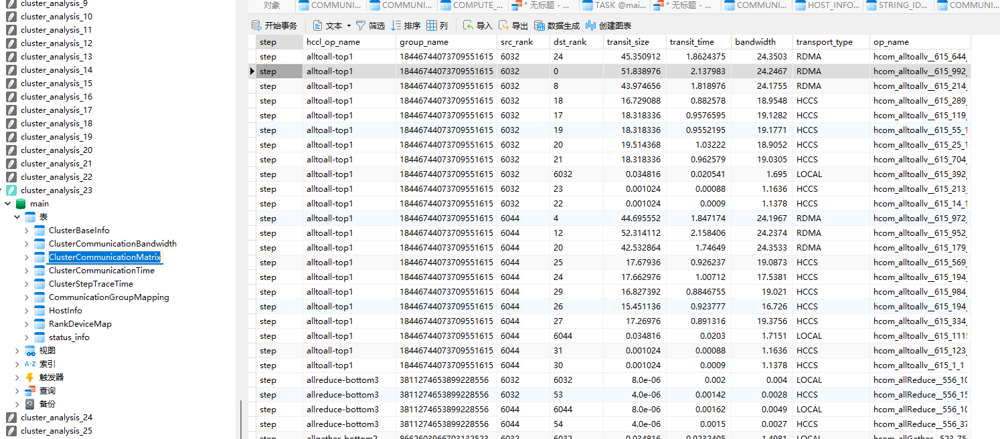
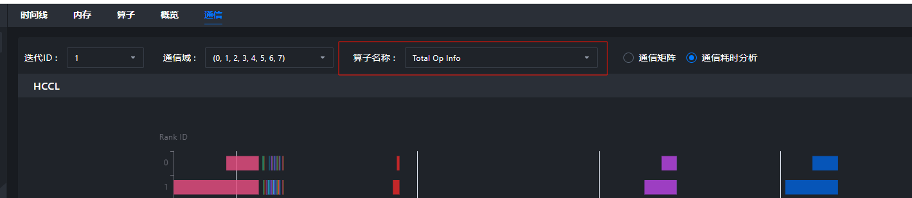
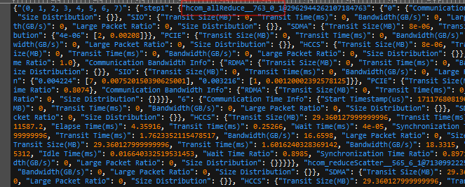
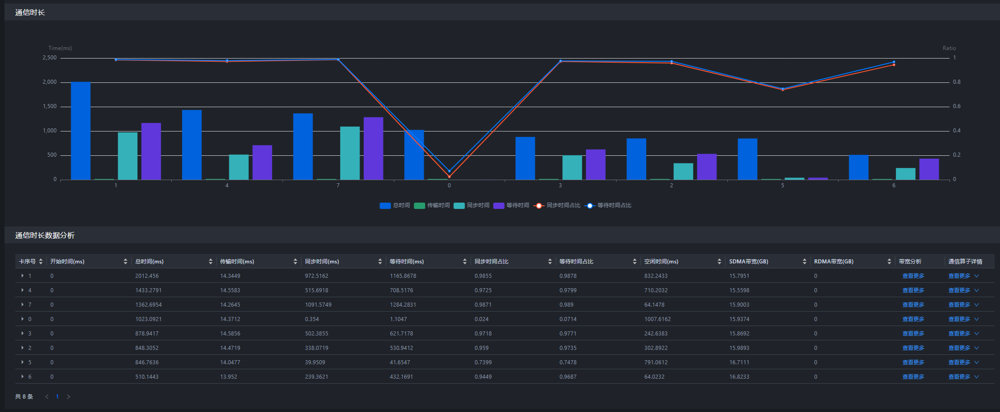
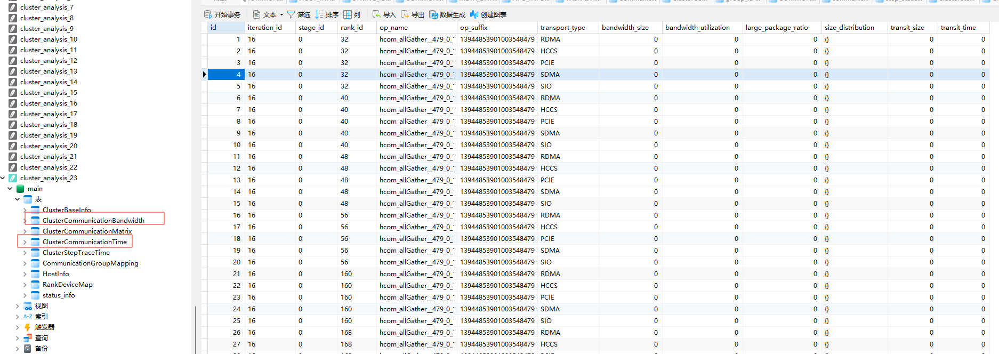
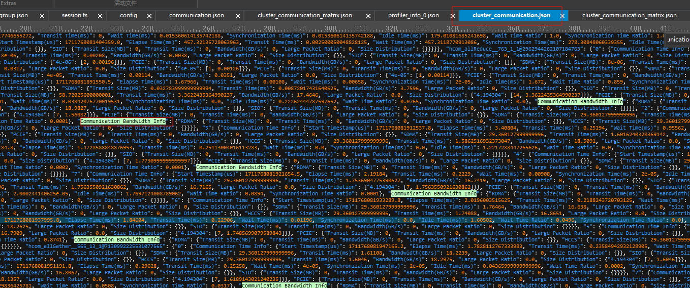
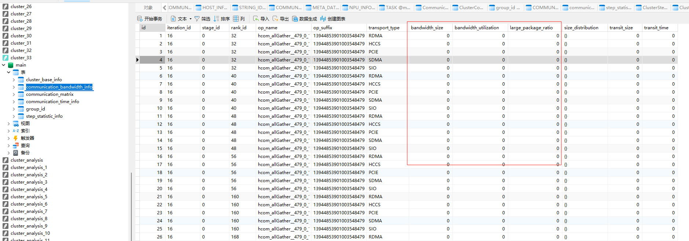

# Communication部分设计文档 

## 接口与数据映射关系

### 原始数据（ATT处理后文件）

#### text场景

#### db场景

### 处理后db数据内容

#### text场景

#### db场景

| 页面数据 | URL请求 | db数据类型 | text数据类型 |
| --- | --- | --- | --- |
|  | communication/matrix/bandwidthInfo |  |   |
|  | communication/duration/iterations |  |  |
|  | communication/matrix/group |  |  底层数据来源于： |
|  | communication/matrix/sortOpNames |  |  底层数据： |
|  | communication/duration/operatorNames |  |  数据： |
|  | communication/operatorLists |  |  数据： |
|  | communication/duration/list | 专家建议是由以上数据计算得到 |  |
|  | communication/operatorDetails |  |  |
|  | communication/distribution |  |  |
|  | communication/bandwidth |  |  |
