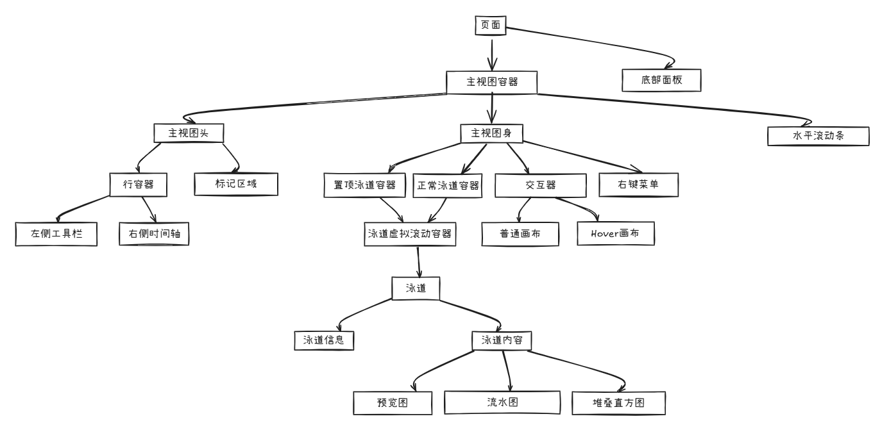
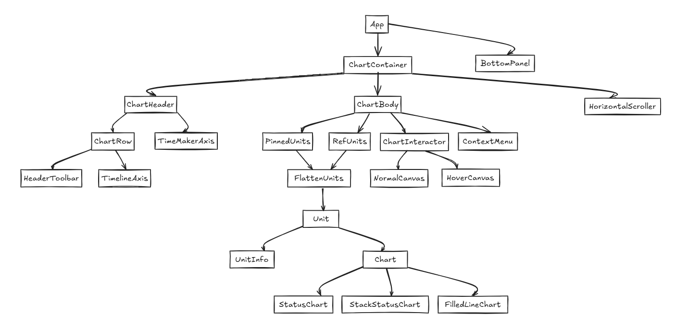
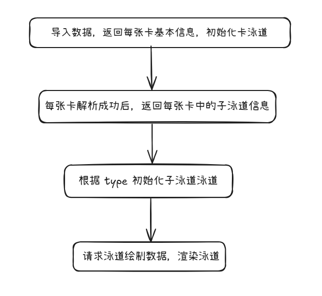

# 泳道绘制

## 1、概述

Timeline 中泳道绘制涉及以下几个区域，分别是：

**① 时间轴区域**、**② 标记区域**、**泳道区域**（每条泳道包含 **③ 泳道信息**、**④ 泳道内容**）。


## 2、组件关系





## 3、时间轴区域

**组件：**

```html
<TimelineAxis />
```

**绘制频率：** 使用自定义的渲染引擎 renderEngine 持续重绘

**绘制内容：** 根据 session.domain 中的 _domainStart 和_domainEnd 计算

## 4、标记（插旗）区域

**组件：**

```html
<TimeMarkerAxis />
```

**绘制时机：**
依赖以下参数的变化：
width（区域宽度）、domainStart、domainEnd、 session.timelineMarker.refreshTrigger（触发标志）、 session.selectedRange

**绘制内容：**

1. 点击插旗：通过点击绘制的插旗，使用 ref=canvas 的画布绘制
2. Hover插旗：鼠标 hover 显示的插旗，使用 ref=flagCursor 的画布绘制
3. 插旗虚线：插旗下方连接的虚线，使用 ref=vertical 的画布绘制

## 5、泳道区域

### 5.1 泳道信息

**组件：**

```html
<UnitInfo />
```

**内容：**

1. 配置组件
2. 置顶组件
3. 泳道名称

### 5.2 泳道内容

**组件：**

```html
<Chart />
```

#### 5.2.1 泳道类型

在 AscendUnit.tsx 中定义了泳道类，以下为每种类型的泳道对应渲染的图表类型，目前使用到的图表类型有三种：
**StatusChart、StackStatusChart、FilledLineChart**

| 泳道类型    | 图表类型             |
|---------|------------------|
| Root    | -                |
| Card    | -                |
| Process | StatusChart      |
| Thread  | StackStatusChart |
| Counter | FilledLineChart  |
| Label   | -                |

#### 5.2.2 数据接口

| 接口                       | 描述       |
|--------------------------|----------|
| import/action            | 导入文件路径   |
| parse/success            | 数据解析成功   |
| unit/threadTracesSummary | 获取线程预览数据 |
| unit/threadTraces        | 获取线程数据   |
| unit/counter             | 获取直方图数据  |

#### 5.2.3 总体流程



1. 导入数据（import/action）：获取到所有卡的基础信息，遍历数据实例化每张卡泳道 new CardUnit，并储存在 session.units 中；

   

2. 单卡解析成功（parse/success）：每张卡解析成功后，后端会返回该卡解析成功的事件，事件中包含该卡的详情数据（如子泳道数据 children、metadata等）。遍历 children，根据数据类型 type 实例化不同类型泳道，并将子泳道补充到 session.units 对应的父泳道中；\

   

   

3. 当展开泳道时，会请求该泳道的内容（绘制）数据，不同泳道使用不同接口：

   | 泳道类型       | 接口                       | 描述       |
   |------------|--------------------------|----------|
   | Label 泳道   | -                        | -        |
   | Process 泳道 | unit/threadTracesSummary | 获取线程预览数据 |
   | Thread 泳道  | unit/threadTraces        | 获取线程数据   |
   | Counter 泳道 | unit/counter             | 获取直方图数据  |

### 5.3 泳道遮罩

在所有泳道内容区域中，有 NormalCanvas 和 HoverCanvas 两个画布，用于跨泳道内容的绘制，其中 HoverCanvas 用于鼠标移动过程中的所需内容绘制。

这两个画布中定义鼠标事件、键盘事件通过 useImperativeHandle 向外暴露，实际绑定在 ChartContainer 组件上。

[画布](./figures/track-render/content-4.png)

## 6、交互

### 6.1 置顶

### 6.2 框选

### 6.3 缩放

### 6.4 跳转
