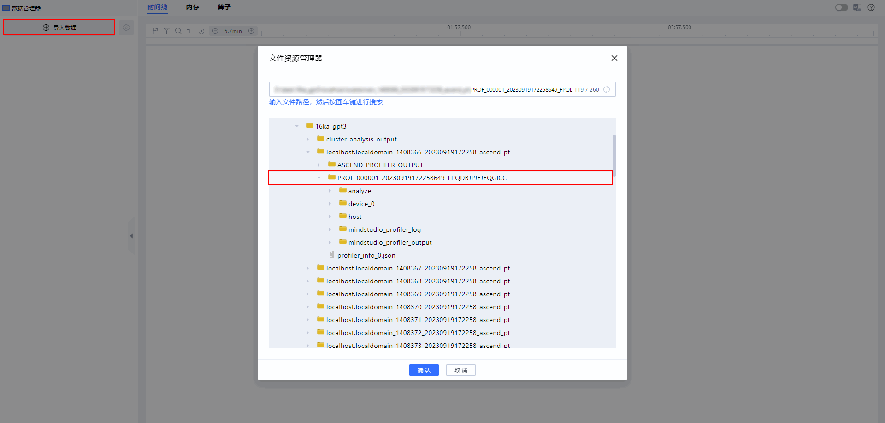
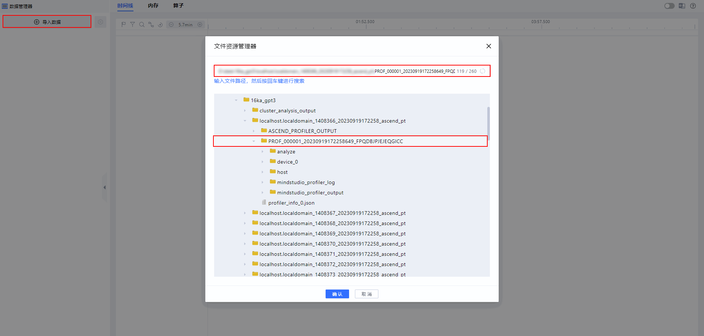
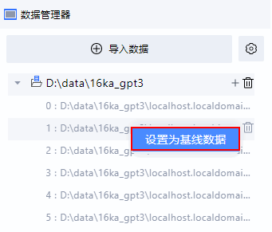
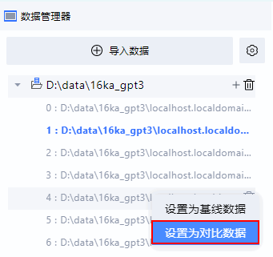
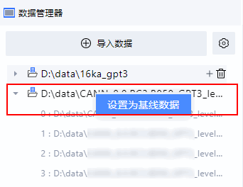

# **MindStudio Insight基础操作**

## 简介

MindStudio Insight工具为可视化调优工具，首先需完成工具基础配置的适配与常用操作的熟悉。本文档主要介绍主题与语言配置、数据导入、数据管理、日志管理的操作，以及快捷键相关信息。

## 安装说明

请先安装MindStudio Insight工具，具体安装步骤请参见[MindStudio Insight安装指南](./mindstudio_insight_install_guide.md)。

## 设置主题与语言

**设置主题**

1. 打开MindStudio Insight工具。
2. 单击界面右上方，切换主题，可切换为亮色或者暗色主题。

**设置语言**

1. 打开MindStudio Insight工具。
2. 单击界面右上方，切换MindStudio Insight工具的中英文。

## 导入数据

MindStudio Insight工具支持三种数据导入方式，本节主要介绍数据导入的操作步骤。

**操作步骤**

- 方式一：选择性能数据路径
    1. 打开MindStudio Insight工具，单击界面左上方“导入数据”。
    2. 在弹窗中选择性能数据文件或目录，然后单击“确认”进行导入，如[**图 1**  选择路径](#选择路径)所示。

        **图 1**  选择路径 
        

- 方式二：输入性能数据路径
    1. 打开MindStudio Insight工具，单击界面左上方“导入数据”。
    2. 在弹窗中的输入框直接输入需要导入的性能数据所在正确路径，然后按键盘上的“ENTER”键，在下方自动定位至该目录。
    3. 单击“确认”进行导入，如[**图 2**  输入正确路径](#输入正确路径)所示。

        **图 2**  输入正确路径  
        

- 方式三：拖拽性能文件至MindStudio Insight工具界面

    打开MindStudio Insight工具，将性能文件拖拽至MindStudio Insight工具界面打开，展示对应页面。可支持拖拽单文件和单文件夹性能数据。

> [!NOTE] 说明
>
> - 仅支持本地磁盘数据导入，如果是网络磁盘，则需要先将网络磁盘映射至本地，再导入对应目录，网络磁盘映射至本地的操作请参见[MindStudio Insight工具拖入网络磁盘目录无法加载数据](./FAQ.md#mindstudio-insight工具拖入网络磁盘目录无法加载数据)。
> - 如果Windows系统上的MindStudio Insight工具在拖入文件时，显示禁用，请参见[MindStudio Insight工具拖入文件显示禁用](./FAQ.md#mindstudio-insight工具拖入文件显示禁用)解决。

## 管理数据

MindStudio Insight工具导入数据后，在数据管理器下会将当次导入的数据生成一个工程，该工程下显示当次导入数据的详情。MindStudio Insight具有数据记忆、数据管理以及数据对比功能。

**数据记忆**

当再次打开同一个版本的MindStudio Insight工具时，在界面左侧导航栏会自动记忆并展示上一次关闭工具时的数据。

**数据管理**

主要介绍在MindStudio Insight界面创建、删除、添加，以及修改数据工程信息的操作。

**表 1**  数据管理操作

|操作|步骤|
|--|--|
|创建数据工程|单击界面左上方“导入数据”，成功导入后，在数据管理器列表中自动创建一个数据工程。|
|修改数据工程名称|在数据管理器列表中，选择所需工程，在工程名称上双击鼠标左键，输入新的名称，即可修改工程名。|
|删除单个数据工程|单击工程行后面的，删除该工程。|
|删除多个数据工程|单击导入数据左侧的，勾选需要删除的工程，默认勾选全部工程，单击数据管理器列表中全部按钮所在行的，删除所选工程。|
|工程内导入数据|单击工程行后面的，在该工程下导入数据。|
|工程内删除数据|单击工程内所选数据行后面的，删除该工程内所选数据。|
|查看数据路径|在数据管理器列表中，选择所需工程或数据，单击鼠标右键，选择在文件资源管理器中打开，即可跳转至对应的数据文件路径。|

> [!NOTE]  说明  
> 删除数据工程操作不会影响原始的性能文件。

**数据对比**

MindStudio Insight工具支持单卡数据间的性能对比，也支持集群数据间的性能对比，需要设置基线数据和对比数据进行对比。

- 设置单卡对比
    1. 选择需要设置为基线的卡目录，单击鼠标右键，选择“设置为基线数据”，设置当前选中卡为基线卡，如[**图 1**  设置基线数据](#设置基线数据)所示。

        设置完成后，当前卡目录会标识颜色。在当前卡再次单击鼠标右键，选择“取消设置基线数据”，可直接取消当前卡的基线状态；也可重新选择任意一张卡目录，单击鼠标右键，选择“设置为基线数据”，则会重新将当前所选卡作为基线数据。

        **图 1**  设置基线数据  
        

    2. 选择需要作为对比卡的卡目录，单击鼠标右键，选择“设置为对比数据”，设置所选卡为对比卡，如[**图 2**  设置对比数据](#设置对比数据)所示。

        设置完成后，对比卡目录会标识颜色，且区别于基线数据目录的颜色。对比数据只能选择当前打开的工程下的卡目录作为对比卡。在当前对比卡上再次单击鼠标右键，选择“取消设置对比数据”，可直接取消当前对比卡的对比状态；也可重新选择任意一张卡目录，单击鼠标右键，选择“设置为对比数据”，则会重新设置对比数据。

        **图 2**  设置对比数据  
        

    3. 基线数据和对比数据设置成功后，可前往时间线（Timeline）、内存（Memory）以及算子（Operator）界面查看数据对比详情。

- 设置集群对比
    1. 选定一个对比数据，当前选中显示的数据即为对比数据。
    2. 选择基线数据。

        选择需要设置为基线的集群目录，单击鼠标右键，选择“设置为基线数据”，如[**图 3**  设置基线数据](#设置基线数据2)所示。

        设置完成后，当前集群目录会标识颜色。在当前集群目录再次单击鼠标右键，选择“取消设置基线数据”，可直接取消当前集群目录的基线状态；也可重新选择任意一个集群目录，单击鼠标右键，选择“设置为基线数据”，则会重新将当前所选集群目录作为基线数据。

        > [!NOTE] 说明  
        > 当在某一个工程中导入的集群数据目录为“cluster\_analysis\_output”时，也可选择该工程下的此数据设置为基线数据。

        **图 3**  设置基线数据  
        

    3. 基线数据设置成功后，可前往概览（Summary）和通信（Communication）界面查看数据对比详情。

## 管理日志

**查看日志存放路径**

查看日志文件存放路径有两种方式，一种是直接查看路径，另一种是可在界面操作。

- 日志文件存放路径

    MindStudio Insight工具的日志文件存放路径请参见[**表 1**  日志文件存放路径](#日志文件存放路径)。

    **表 1**  日志文件存放路径

    |系统|日志存放路径|
    |--|--|
    |Windows|- 安装路径为C盘，日志路径为：C:\Users\\{*用户名*}\\.mindstudio_insight  - 安装路径为其他目录，日志路径为：{*安装目录*}\\.mindstudio_insight|
    |Linux|$HOME/.mindstudio_insight|
    |macOS|/Users/{*用户名*}/.mindstudio_insight|

- 界面操作

    在MindStudio Insight工具界面中，单击右上方，选择“在资源管理器中显示日志”，即可进入日志存放目录进行查看。

    > [!NOTE]  说明  
    > 此功能仅支持Windows系统和macOS系统。

**日志文件说明**

MindStudio Insight工具的日志文件名称为“profiler\_server\_\{_端口号_\}\_\{_编号_\}.log”，为程序运行日志，主要供开发者定位问题使用。

**日志清理机制**

MindStudio Insight工具的日志清理方式包括自动清理和手动清理。

- 自动清理

    MindStudio Insight工具的日志文件具有自动清理机制。由于MindStudio Insight工具每个端口仅支持存放10个日志文件，所以当日志文件数量超过10个后，后续生成的日志文件会自动从第一个日志文件开始覆盖，依次循环，且单个日志文件大小不超过10MB。

- 手动清理

    进入日志文件存放路径，手动删除对应日志文件，日志存放路径参见[查看日志存放路径](#日志文件存放路径)。

## 常用快捷键

本节介绍MindStudio Insight工具的常用快捷键。也可在MindStudio Insight工具界面中，单击右上方，选择“键盘快捷键”，查看快捷键信息。

**表 1**  常用快捷键

|快捷键|说明|
|--|--|
|W|放大时间线（Timeline）界面的图形化窗格。|
|S|缩小时间线（Timeline）界面的图形化窗格。|
|Ctrl + 鼠标滚轮|缩小、放大时间线（Timeline）界面的图形化窗格。如果是macOS系统，需要使用Command + 鼠标滚轮。|
|Alt + 鼠标左键|放大时间线（Timeline）界面框选的区域。如果是macOS系统，需要使用Option + 鼠标左键。|
|Shift + Z|将时间线（Timeline）界面框选区域放大至当前屏幕。|
|Backspace|撤销一次时间线（Timeline）界面图形化窗格的缩放。|
|A/左方向键|左移时间线（Timeline）界面的图形化窗格。|
|D/右方向键|右移时间线（Timeline）界面的图形化窗格。|
|Ctrl + 鼠标左键|拖动可左右移动时间线（Timeline）界面的图形化窗格。如果是macOS系统，需要使用Command + 鼠标左键。|
|上方向键|上移时间线（Timeline）界面的图形化窗格。|
|下方向键|下移时间线（Timeline）界面的图形化窗格。|
|Ctrl + 0|重置时间线（Timeline）界面的图形化窗格。如果是macOS系统，需要使用Command + 0。|
|M|框选时间线（Timeline）界面所选的单个算子区域，再次按下M键，可取消框选。|
|L|在时间线（Timeline）界面，选中算子后，将选中算子与基准算子的开始时间（左边界）对齐。|
|R|在时间线（Timeline）界面，选中算子后，将选中算子与基准算子的结束时间（右边界）对齐。|
|Q|收起或展开时间线（Timeline）界面底部的面板。|
|K|在时间线（Timeline）界面，使用K键可快速设置区域标记和单点标记。|
|Shift + 鼠标滚轮/Ctrl + 鼠标拖动|在流水并行图和通信算子缩略图中，可左右移动图表。|
|Ctrl + 鼠标滚轮|在流水并行图和通信算子缩略图中，可放大或缩小图表。|
|Ctrl + F|调出源码（Source）界面源文件代码区域的搜索框，进行搜索。如果是macOS系统，需要使用Command + F。|
