# **MindStudio Insight算子调优**

## 简介

MindStudio Insight提供指令流水视图、算子源码视图以及算子运行负载分析视图，直观地将运行在昇腾AI处理器上的算子的关键性能指标进行可视化呈现，帮助用户快速定位算子的软硬件性能瓶颈，提升算子性能分析的效率。

## 使用前准备

**环境准备**

请先安装MindStudio Insight工具，具体安装步骤请参见[MindStudio Insight安装指南](./mindstudio_insight_install_guide.md)。

**数据准备**

请导入正确格式的性能数据，具体数据说明请参见[数据说明](#数据说明)，数据导入操作请参见[导入数据](./basic_operations.md#导入数据)。

## 数据说明

**数据文件**

算子调优场景支持导入的性能数据文件请参见[**表 1**  支持导入的性能数据](#支持导入的性能数据)。

**表 1**  支持导入的性能数据

<table><thead>
  <tr>
    <th>文件名</th>
    <th>说明</th>
    <th>文件获取方式</th>
    <th>显示界面</th>
  </tr></thead>
<tbody>
  <tr>
    <td>trace.json</td>
    <td>算子仿真指令流水图文件。</td>
    <td>参见《<a href="https://gitcode.com/Ascend/msopprof/blob/master/docs/zh/user_guide/msopprof_simulator_user_guide.md">msopprof simulator用户指南</a>》。</td>
    <td>时间线（Timeline）</td>
  </tr>
  <tr>
    <td rowspan="3">visualize_data.bin</td>
    <td>指令流水图可视化呈现文件。</td>
    <td>参见《<a href="https://gitcode.com/Ascend/msopprof/blob/master/docs/zh/user_guide/msopprof_user_guide.md">msopprof用户指南</a>》和《<a href="https://gitcode.com/Ascend/msopprof/blob/master/docs/zh/user_guide/msopprof_simulator_user_guide.md">msopprof simulator用户指南</a>》。</td>
    <td>时间线（Timeline）</td>
  </tr>
  <tr>
    <td>算子基础信息、计算单元负载和Roofline瓶颈分析等信息的可视化呈现文件。</td>
    <td>参见《<a href="https://gitcode.com/Ascend/msopprof/blob/master/docs/zh/user_guide/msopprof_user_guide.md">msopprof用户指南</a>》。</td>
    <td>详情（Details）</td>
  </tr>
  <tr>
    <td>仿真热点函数等信息可视化呈现文件。</td>
    <td>参见《<a href="https://gitcode.com/Ascend/msopprof/blob/master/docs/zh/user_guide/msopprof_user_guide.md">msopprof用户指南</a>》和《<a href="https://gitcode.com/Ascend/msopprof/blob/master/docs/zh/user_guide/msopprof_simulator_user_guide.md">msopprof simulator用户指南</a>》。</td>
    <td>源码（Source）</td>
  </tr>
  <tr>
    <td>visualize_data.bin</td>
    <td>用户程序Kernel函数内的L2 Cache访问信息可视化呈现文件。</td>
    <td>参见《<a href="https://gitcode.com/Ascend/msopprof/blob/master/docs/zh/user_guide/msopprof_user_guide.md">msopprof用户指南</a>》。</td>
    <td>缓存（Cache）</td>
  </tr>
</tbody>
</table>

**约束**

- MindStudio Insight在算子调优场景下，支持导入的json文件中，需要在文件内容中第一个中括号之前有"profilingType":"op"字段标识，才可被导入。
- 支持以文件夹方式导入json文件，一个文件夹下可存在多个子文件夹，但是子文件夹下不能存在多个json文件，不同的json文件需要放在不同的子文件夹下。
- 建议导入的json文件单文件大小不超过1GB。
- 支持导入的二进制bin文件只允许单个文件导入，不支持以文件夹方式导入。
- 建议导入的bin文件单文件大小不超过500MB。
- 仅<term>Atlas 350 加速卡</term>支持通过“msopprof”方式采集指令流水图可视化呈现文件，数据展示在时间线（Timeline）界面。

## 时间线（Timeline）

### 功能说明

在算子性能调优过程中，MindStudio Insight工具以时间线（Timeline）的呈现方式，将算子运行过程中，底层指令的详细执行情况平铺在时间轴上，直观呈现AI处理器每个Core上的每个Pipe中指令的调用顺序和耗时情况。通过分析时间线，用户可以通过查看指令详情、指令耗时等信息快速定位出性能瓶颈。

通过观察时间线视图各个层级上的耗时长短、间隙等判断对应指令和Pipe是否存在性能问题，如指令执行是否存在瓶颈、是否存在高耗时的指令等。

### 界面介绍

**界面展示**

时间线（Timeline）界面包含工具栏（区域一）、图形化展示（区域二）和数据窗格（区域三）三个部分组成，如[**图 1**  时间线界面](#时间线界面)所示。

**图 1**  时间线界面  
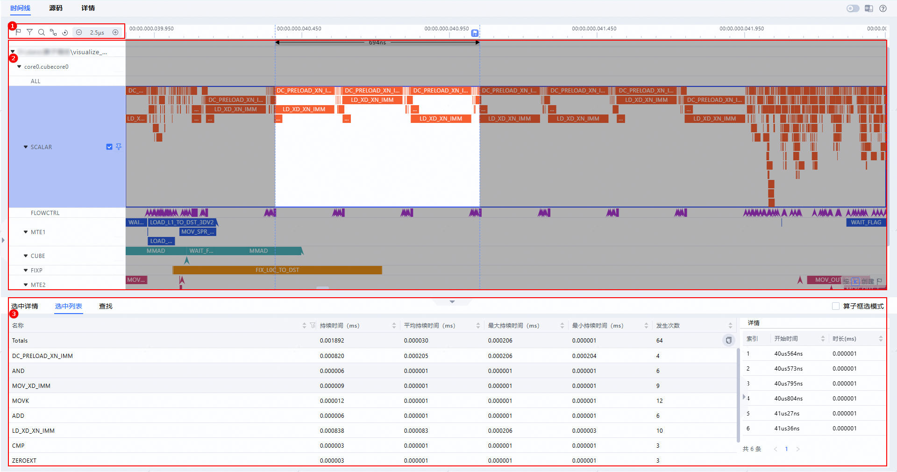

- 区域一：工具栏，包含常用快捷按钮，从左至右依次为标记列表、过滤（支持按卡或按泳道过滤展示）、搜索、连线事件、重置缩放（页面复原）和时间轴缩小放大按钮。
- 区域二：图形化展示，左侧显示各Core的分层信息，一层级为Core，二层级为Pipe。右侧为时间线视图，逐行对时间线进行图形化展现，包括各指令执行序列和执行时长。具体泳道信息请参见[泳道信息](#泳道信息)。
- 区域三：数据窗格，统计信息或指令详情信息展示区，选中详情（Slice Detail）为选中单个指令的详细信息、选中列表（Slice List）为某一泳道选中区域的指令列表信息。

**泳道信息**

|泳道名称|说明|
|--|--|
|ALL|表示在这个通道的指令在所有通道都执行。|
|SCALAR|标量运算单元。|
|FLOWCTRL|控制流指令。|
|MTE1|数据搬运流水，数据搬运方向为：L1 ->{L0A/L0B, UBUF}。|
|CUBE|矩阵乘运算单元。|
|FIXP|数据搬运流水，数据搬运方向为：FIXPIPE L0C -> OUT/L1。  仅<term>Atlas A2 训练系列产品/Atlas A2 推理系列产品</term>导出的性能数据支持展示。|
|MTE2|数据搬运流水，数据搬运方向为：{DDR/GM, L2} ->{L1, L0A/B, UBUF}。|
|VECTOR|向量运算单元。|
|MTE3|数据搬运流水，数据搬运方向为：UBUF -> {DDR/GM, L2, L1}、L1->{DDR/L2}。|
|CACHEMISS|未命中ICACHE。|
|USEMASK|自定义打点范围。|
|MTE Throughput|内存吞吐率信息。  - GM_TO_L1：GM往L1搬运的数据吞吐率。  - GM_TO_TOTAL：GM输出总数据吞吐率。  - GM_TO_UB：GM往UB搬运的数据吞吐率。  - L1_TO_GM：L1往GM搬运的数据吞吐率。  - TOTAL_TO_GM：GM输入总数据吞吐率。  - UB_TO_GM：UB往GM搬运的数据吞吐率。|

### 使用说明

#### 基础功能

**支持界面缩放**

时间线（Timeline）界面支持缩小、放大和左右移动等功能，具体操作如下所示：

- 单击时间线（Timeline）界面树状图或者图形化窗格任意位置，可以使用键盘中的W（放大）和S（缩小）键进行操作，支持放大的最大精度为1ns。
- 单击时间线（Timeline）界面树状图或者图形化窗格任意位置，使用键盘中的A（左移）、D（右移）键，或者方向键左键（左移）、右键（右移）进行左右移动，也可使用方向键上键（上移）、下键（下移）进行上下移动。
- 在图形化窗格中，使用键盘中的Alt键加鼠标左键可以使选中区域实现局部放大。
- 单击界面左上方工具栏中的（放大）和（缩小）实现缩放。
- 单击界面左上方工具栏中的可以一键恢复图形化窗格显示全部时间线视图。
- 将鼠标放置在时间线（Timeline）界面树状图或者图形化窗格任意位置，可以使用键盘中的Ctrl键加鼠标滚轮实现缩放操作。
- 在图形化窗格中，使用键盘中的Ctrl键加鼠标左键可以实现左右拖拽泳道图表。

    > [!NOTE] 说明   
    > macOS系统中，需使用键盘上的Command键加鼠标滚轮实现缩放，Command键加鼠标左键实现左右拖拽泳道图表。

- 在图形化窗格中，可使用鼠标右键菜单进行缩放展示，具体功能参见[**表 1**  鼠标右键菜单功能](#鼠标右键菜单功能)。

    **表 1**  鼠标右键菜单功能

    |中文菜单|英文菜单|说明|操作|
    |--|--|--|--|
    |全屏显示|Fit to screen|将单个指令放大至屏幕可见范围最大宽度。如果未选中指令，则不显示该参数。|单击选中一个指令，单击鼠标右键，弹出菜单；单击全屏显示，可将选中指令放大至屏幕可见范围最大宽度。|
    |放大所选内容|Zoom into selection|将选定区域放大至屏幕可见范围最大宽度。如果无选定区域，则不显示该参数。|选定某个区域后，单击鼠标右键，弹出菜单；单击放大所选内容，可将选定区域放大至屏幕可见范围最大宽度。|
    |撤销缩放（0）|Undo Zoom(0)|撤销缩放，括号中的数字会随着缩放次数随之变化，初始状态为0。|在放大后的时间线（Timeline）界面，单击鼠标右键，弹出菜单；单击撤销缩放，界面缩小一次，括号中的数字会随之减一。|
    |重置缩放|Reset Zoom|重置缩放，将图表恢复至初始状态。|在放大后的时间线（Timeline）界面，单击鼠标右键，弹出菜单；单击重置缩放，图表重置，恢复至初始状态。|

**指令搜索功能**

MindStudio Insight在时间线（Timeline）界面支持指令搜索。

- 单击界面左上方工具栏中的，在弹出输入框中输入需要搜索的指令，然后按回车键，则会匹配对应的指令，搜索结果匹配指令总数，如[**图 1**  搜索指令总数](#搜索指令总数)所示，搜索到与名称中包含“mov”相关的指令总数为11754。

    **图 1**  搜索指令总数  
    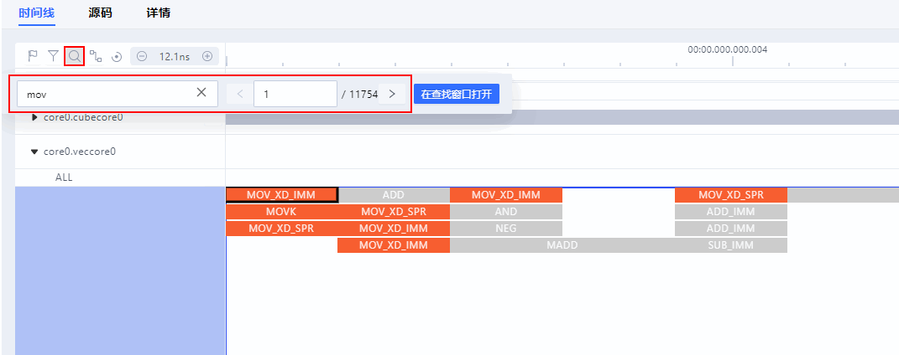

- 单击界面左上方工具栏中的，可在搜索弹出输入框左侧分别单击和，开启大小写匹配和全词匹配功能，如[**图 2**  大小写匹配和全词匹配](#大小写匹配和全词匹配)所示。

    单击开启大小写匹配，输入需要搜索的信息，按回车键，则会匹配名称中包含搜索项的指令。

    单击开启全词匹配，输入需要搜索的信息，按回车键，则会匹配名称为搜索项的指令，但是会忽略大小写。

    当同时选中和时，开启大小写匹配和全词匹配功能，在输入框中输入需要搜索的指令名称，按回车键，则会精确匹配名称为搜索项的指令。

    **图 2**  大小写匹配和全词匹配  
    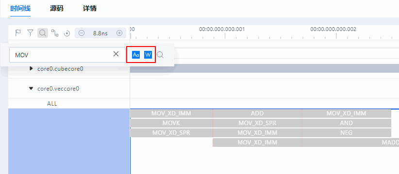

- 单击搜索框后方的切换按钮，可以查看上一个或者下一个匹配的指令，也可以在输入框后方输入具体的数字搜索其对应的指令，该指令将会被选中并显示在界面中部，如[**图 3**  定位指令](#定位指令)所示。

    **图 3**  定位指令  
    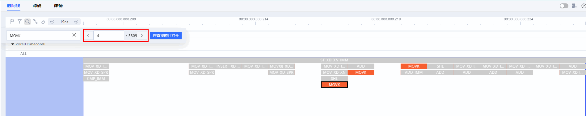

- 单击搜索框后方的“在查找窗口打开”，可跳转至界面下方的“查找”页签，展示所有搜索指令列表，如[**图 4**  在查找窗口打开](#在查找窗口打开-2)所示，字段解释如[**表 2**  字段说明](#字段说明)所示。单击“点击跳转Timeline”列的“点击”可跳转到指令在时间线视图上的具体位置。

    **图 4**  在查找窗口打开  
    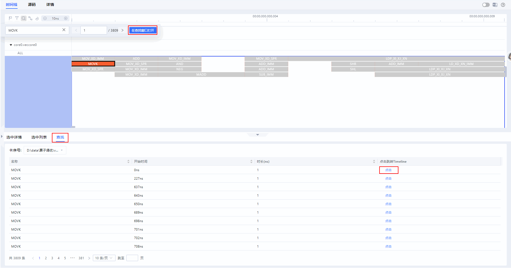

    **表 2**  字段说明

    |中文字段|英文字段|说明|
    |--|--|--|
    |卡序号|Rank ID|卡序号，可以选择需要查看的数据文件。|
    |名称|Name|指令名称。|
    |开始时间|Start Time|指令执行起始时间。|
    |时长(ns)|Duration(ns)|指令运行总耗时。|
    |点击跳转Timeline|Click To Timeline|单击“点击”跳转到指令在时间线视图上的具体位置。|

#### 性能数据展示

**设置和查看标记**

- 区域标记

  在时间线（Timeline）界面选中某个区域后，单击或敲击键盘K键将选中区域进行标记并保存，如[**图 1**  区域标记](#区域标记-4)所示。

  **图 1**  区域标记  
  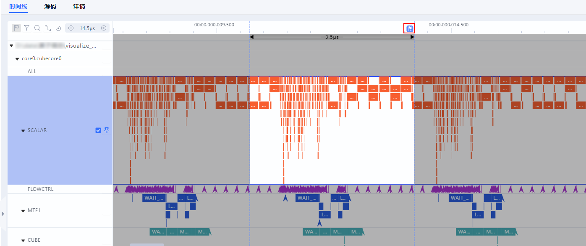

  左键双击任一标记，可以设置该标记对的属性，支持修改标记对名称、颜色以及删除该标记对，如[**图 2**  修改标记对属性](#修改标记对属性-5)所示。

  **图 2**  修改标记对属性  
  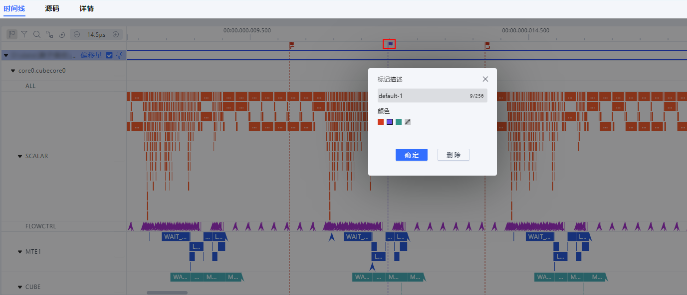

- 单点标记

  在最上方空泳道的任意位置，单击鼠标左键或敲击键盘K键，将生成一个单点标记，如[**图 3**  单点标记](#单点标记-6)所示。左键双击标记，可以设置该标记的属性，支持修改标记的名称、颜色以及删除该标记。

  **图 3**  单点标记  
  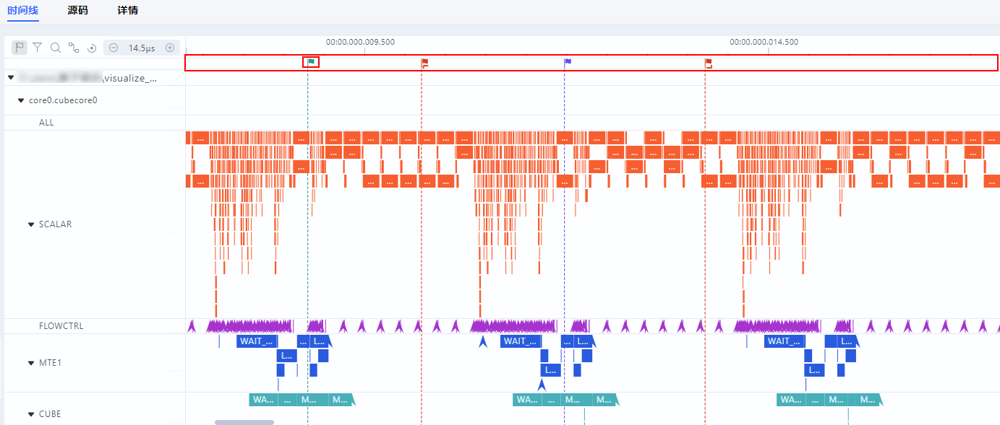

- 标记管理

  单击左上方工具栏中的，将显示所有标记信息，如[**图 4**  查看标记信息](#查看标记信息-7)所示。

  **图 4**  查看标记信息  
  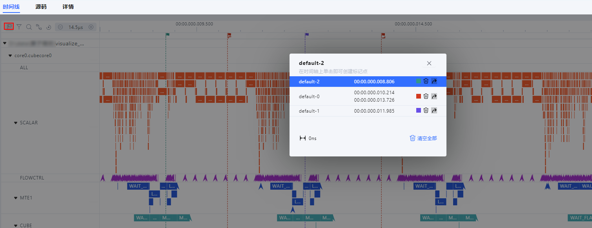

  - 单击某个标记对应的图标可删除标记。
  - 单击弹窗下方的“清空全部”可删除所有标记。
  - 单击区域标记，界面下方的“选中详情”页签会显示该区域的耗时信息详情。
  - 如果某一标记不在当前可视化界面，单击该标记对应的图标将直接跳转至标记界面，便于查看。
  - 单击某个标记对应的颜色图标可进行颜色设置，便于对标记进行分类管理。

**指令间同步连线功能**

- MindStudio Insight支持指令间同步连线关系（SET\_FLAG到WAIT\_FLAG）展示，单击有连线的指令，即可显示该指令关联的连线，即使折叠连线起点或者终点的Pipe，连线也不会消失，如[**图 5**  指令间连线](#指令间连线)所示。

    **图 5**  指令间连线  
    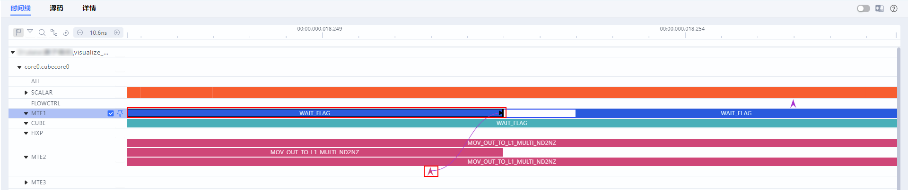

- MindStudio Insight支持全量连线的功能，单击界面左上方工具栏中的，在弹框中选择一个或多个连线类型，则在时间线视图中展示对应Pipe间的所有连线，如[**图 6**  全量连线](#全量连线-8)所示。

    > [!NOTE] 说明   
    > 最多支持选择10个连线类型。

    **图 6**  全量连线  
    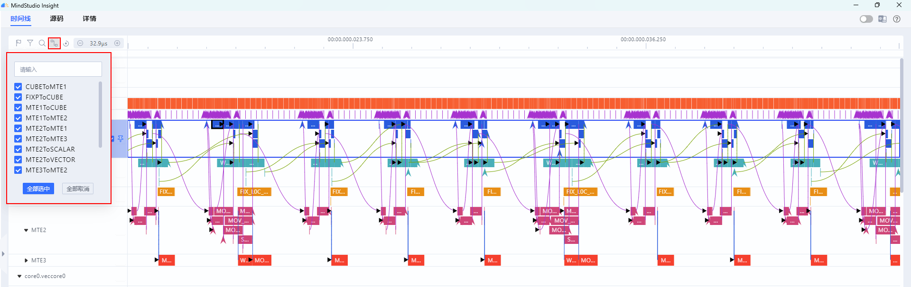

- 支持隐藏SET\_FLAG和WAIT\_FLAG指令。

    在算子展示区域，右键弹出菜单，选择“隐藏SET/WAIT事件”，可隐藏SET\_FLAG和WAIT\_FLAG指令，连线同时消失，如[**图 7**  隐藏SET/WAIT事件](#隐藏SET-WAIT事件)所示。

    **图 7**  隐藏SET/WAIT事件  
    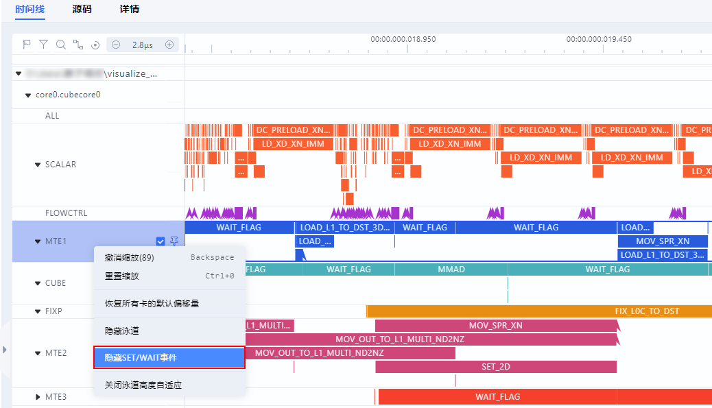

    隐藏SET/WAIT事件后，再次右键弹出菜单，单击“显示SET/WAIT事件”，被隐藏的SET\_FLAG和WAIT\_FLAG指令随之出现，根据连线功能操作，可正常显示指令连线，如[**图 8**  显示SET/WAIT事件](#显示SET-WAIT事件)所示。

    **图 8**  显示SET/WAIT事件  
    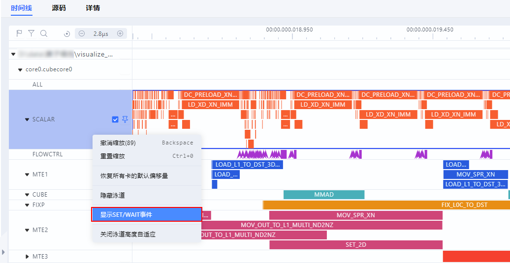

#### 页面调优展示

**泳道隐藏功能**

算子调优场景下的泳道隐藏功能可参见[泳道隐藏功能](./system_tuning.md#页面调优展示)执行操作。

**泳道高度自适应功能**

算子调优场景下的泳道高度自适应功能可参见[泳道高度支持自适应](./system_tuning.md#页面调优展示)执行操作。

#### 统计信息展示

MindStudio Insight支持指令统计信息和单个指令详情信息查看。

- 使用鼠标左键可在单个Pipe级泳道，或跨多个core泳道框选部分指令，框选部分区域指令后，可在下方选中列表显示指令的统计信息，如[**图 1**  选中列表](#选中列表-9)所示，字段解释如[**表 1**  选中列表字段说明](#选中列表字段说明)。

    当鼠标移入“选中列表”页签，单击按钮，可复制当前“选中列表”中所展示的内容，并粘贴至Excel表格中进行分析。

    单击“选中列表”列中的某个指令，在右侧“More”列表中将会显示此区域中与该指令同名的所有指令，单击“More”列表中某一行，则在时间线视图中定位出该指令的具体位置，并同时跳转至“选中详情”页面，可查看该指令的详情信息。

    **图 1**  选中列表  
    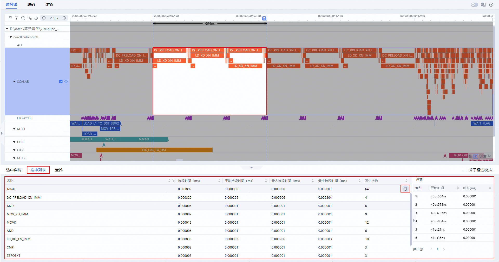

    **表 1**  选中列表字段说明 

    |中文字段|英文字段|说明|
    |--|--|--|
    |名称|Name|指令名称。|
    |持续时间|Wall Duration|指令执行总耗时。|
    |平均持续时间|Average Wall Duration|指令平均执行时间。|
    |最大持续时间|Max Wall Duration|算子最大持续时间。|
    |最小持续时间|Min Wall Duration|算子最小持续时间。|
    |发生次数|Occurrences|指令调用次数。|
    |索引|Index|序号。|
    |开始时间|Start Time|在图形化窗格中的时间戳。|
    |时长(ms)|Duration(ms)|执行耗时。|

- 当选中单个指令时，可在下方选中详情显示该指令的详情信息，如[**图 2**  选中详情](#选中详情-10)所示，字段解释如[**表 2**  选中详情字段说明](#选中详情字段说明)所示。

    选中单个指令，使用M键，可框选该指令所属的时间线（Timeline）区域，再次按下M键，可取消框选。

    **图 2**  选中详情  
    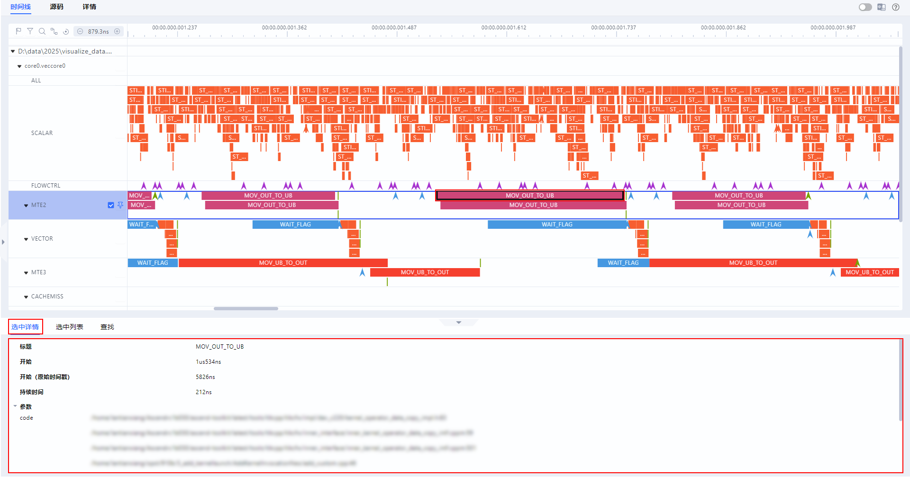

    **表 2**  选中详情字段说明

    |中文字段|英文字段|说明|
    |--|--|--|
    |标题|Title|名称。|
    |开始|Start|起始时间。|
    |开始（原始时间戳）|Start(Raw Timestamp)|数据采集到的原始开始时间。|
    |持续时间|Wall Duration|总耗时。|
    |参数|Args|算子的相关参数信息，包括以下信息：  - code：代码调用栈。  - detail：指令源码。  - pc_addr：pc地址。|

## 源码（Source）

### 功能说明

源码（Source）界面用于展示算子指令热点图，支持查看算子源码与指令集的映射关系和耗时情况，在昇腾Ascend C算子开发过程中，使能开发者进行性能分析。

### 界面介绍

源码（Source）界面包含筛选栏（区域一）、源文件代码属性表（区域二）和指令表（区域三）三个部分组成，如[**图 1**  源码界面](#源码界面)所示。

**图 1**  源码界面  
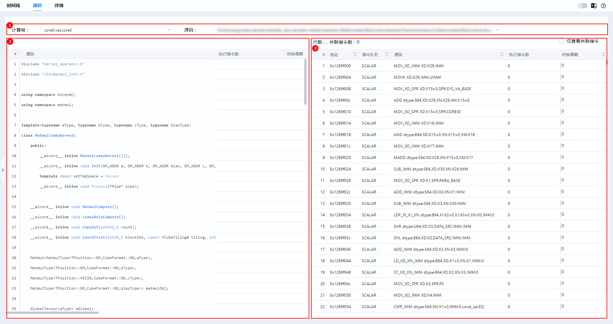

- 区域一：筛选栏，可通过计算核（Core）和源码（Source）进行筛选需要查看的内容。
- 区域二：源文件代码属性表，查看各行代码和其相应的执行时长和次数，表中字段解释如[**表 1**  源文件代码属性表字段说明](#源文件代码属性表字段说明)所示。

    **表 1**  源文件代码属性表字段说明

    |中文字段|英文字段|说明|示例|
    |--|--|--|--|
    |#|#|代码行号。|100|
    |源码|Source|源文件代码。|-|
    |执行指令数|Instructions Executed|该行代码在每个Core上执行的指令数量。|100|
    |时钟周期|Cycles|该行代码在每个Core上执行消耗的Cycles（时钟周期）。|100|
    |通用寄存器数|GPR Count|该行代码在每个Core上执行时使用的通用寄存器次数。仅当使用msopprof simulator采集的数据支持显示该参数。|10|
    |L2 Cache命中率|L2 Cache Hit Rate|该行代码在所有Core上执行的L2 Cache命中率。仅当使用msopprof采集的数据支持显示该参数。|100%|
    |处理数据量(Bytes)|Process Bytes|该行代码在每个Core上执行处理的数据量之和，单位Byte。|2048|

- 区域三：指令表，查看指令记录，包括地址、内容、数量、次数等，表中字段解释如[**表 2**  指令表字段说明](#指令表字段说明)所示。

    **表 2**  指令表字段说明

    |中文字段|英文字段|说明|示例|
    |--|--|--|--|
    |#|#|序号。|100|
    |地址|Address|指令所处的偏移地址。|0x1122a828|
    |指令队列|Pipe|指令所处的Pipe（指令队列）。|MTE2|
    |源码|Source|指令内容。|BAR PIPE:ALL|
    |执行指令数|Instructions Executed|该行指令在每个Core上执行的指令数量。|100|
    |通用寄存器数|GPR Count|该行指令在每个Core上执行时使用的通用寄存器次数。仅当使用msopprof simulator采集的数据支持显示该参数。|10|
    |寄存器状态|GPR Status|寄存器依赖信息，以图形化展示。由多列带箭头的直线组成，每一列代表一个寄存器。其中左实心箭头表示为写，右空心箭头为读，竖线表示当前寄存器仍在使用。当鼠标悬停在寄存器上时，会显示寄存器信息。  仅<term>Atlas 350 加速卡</term>导出的数据支持显示该参数。|-|
    |时钟周期|Cycles|该行指令在每个Core上执行消耗的Cycles（时钟周期）。|100|
    |L2 Cache命中率|L2 Cache Hit Rate|该行指令在所有Core上执行的L2 Cache命中率。仅当使用msopprof采集的数据支持显示该参数。|72%|
    |处理数据量(Bytes)|Process Bytes|该行指令在每个Core上执行处理的数据量，单位Byte。|2048|
    |UB单元读冲突|UB Read Conflict|Vector计算类指令在UB Bank上读的冲突情况。仅当使用msopprof simulator采集的数据支持显示该参数。|1|
    |UB单元写冲突|UB Write Conflict|Vector计算类指令在UB Bank上写的冲突情况。仅当使用msopprof simulator采集的数据支持显示该参数。|0|
    |Vector计算单元利用率百分比|Vector Utilization Percentage|Vector计算单元的利用率，单位%。仅当使用msopprof simulator采集的数据支持显示该参数。|35.29|

### 使用说明

**源码搜索功能**

在源文件代码属性表区域，使用键盘上的Ctrl + F键可调出搜索框，在搜索框中输入所需关键字，可按需选择大小写匹配等功能，按Enter回车键查询，会高亮显示匹配的关键字，如[**图 1**  搜索源码](#搜索源码)所示，搜索框中图标功能如[**表 1**  图标功能说明](#图标功能说明)所示。

> [!NOTE] 说明   
> macOS系统中，需使用键盘上的Command + F键调出搜索框。

**图 1**  搜索源码  
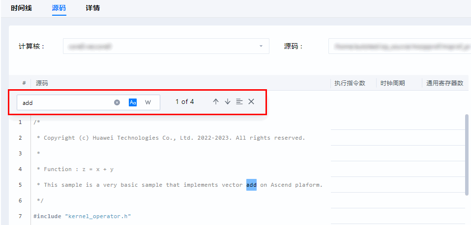

**表 1**  图标功能说明

|图标|功能说明|
|--|--|
||大小写匹配。选定该图标后，可匹配搜索到所输入的关键字，区分大小写。|
||全词匹配。选定该图标后，可搜索到完整匹配的关键字。|
||向上切换搜索结果。|
||向下切换搜索结果。|
||框选源码区域。选定该图标后，可使用鼠标左键选定源码区域，则可在选定区域内进行搜索。|
||关闭搜索框，退出搜索功能。也可以按键盘上的Esc键退出。|

**查看关联指令**

单击源文件代码属性表中任意一行代码，则在指令表将高亮显示此行代码相关指令。指令表上方会显示当前选中代码的行数（Line）和此行代码关联的指令总数（Related Instructions Count），如[**图 2**  查看关联指令](#查看关联指令)所示，此行代码所处位置是第10行，且关联的指令总数为112个。

**图 2**  查看关联指令  
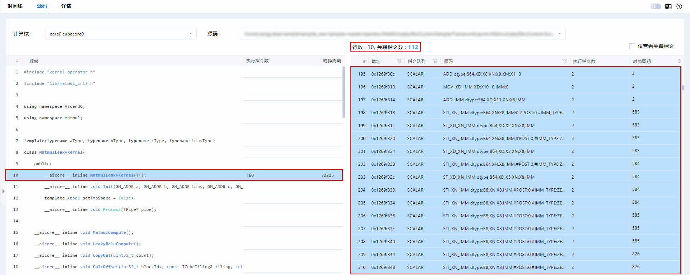

勾选指令表上的“仅查看关联指令”则会进行过滤，只显示此行代码关联的指令，如[**图 3**  过滤关联指令](#过滤关联指令)所示。

**图 3**  过滤关联指令  
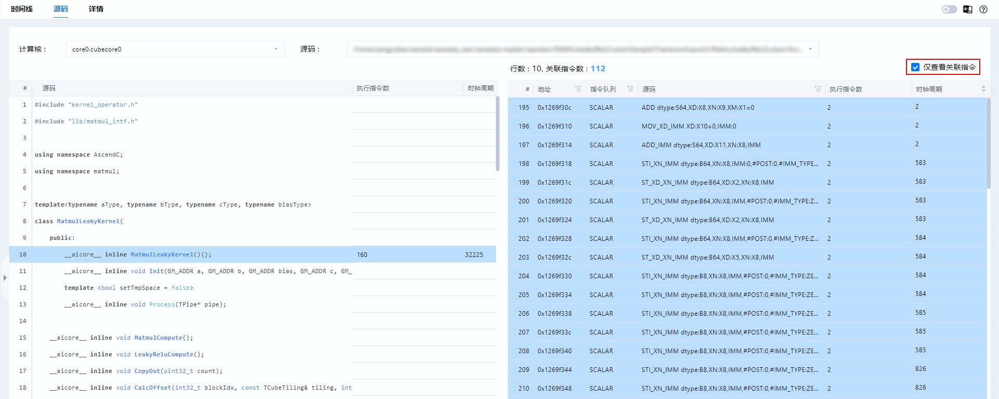

**查看关联代码**

单击指令表中任意一行，则在源文件代码属性表中高亮显示所关联的代码，并且在指令表中高亮显示此行代码所有关联指令，如[**图 4**  查看关联代码](#查看关联代码)所示。

**图 4**  查看关联代码  
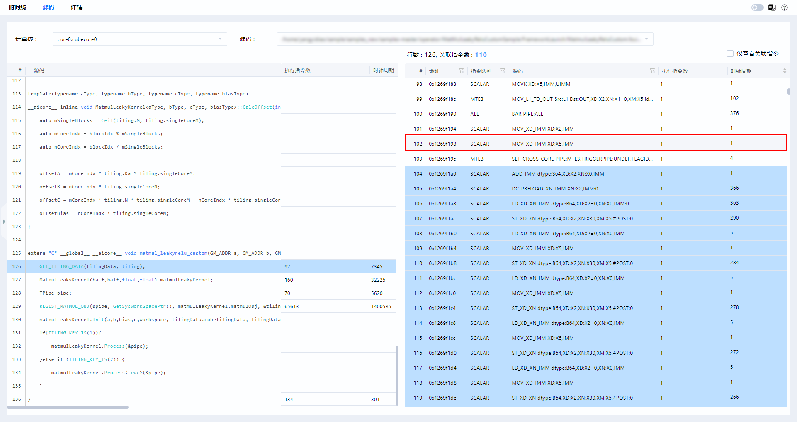

> [!NOTE] 说明   
> 如果有多行关联代码时，只会高亮显示最上层代码。

**筛选指令表**

在指令表中，单击表头每个字段后方的可以筛选需要查看的内容，如[**图 5**  筛选指令表](#筛选指令表)所示。

**图 5**  筛选指令表  
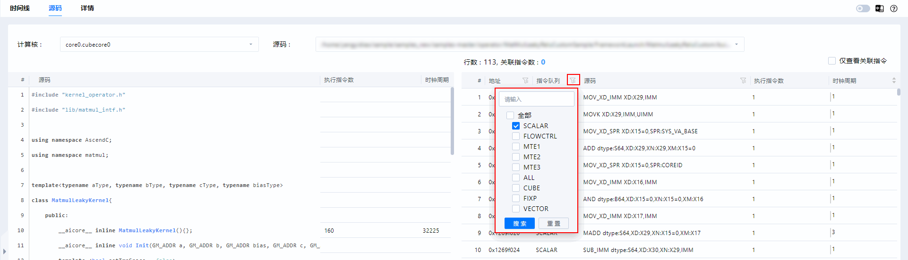

## 详情（Details）

### 功能说明

详情（Details）界面用于展示算子基础信息、计算负载分析、核间负载分析、Roofline瓶颈分析和内存负载分析，并以图形和数据窗格呈现方式展示分析结果。

### 界面介绍

详情（Details）界面包含基础信息（Base Info）（区域一）、核间负载分析（Core Occupancy）（区域二）、Roofline瓶颈分析（Roofline）（区域三）、计算工作负载分析（Compute Workload Analysis）（区域四）和内存负载分析（Memory Workload Analysis）（区域五），如[**图 1**  详情界面](#详情界面)所示。

**图 1**  详情界面  
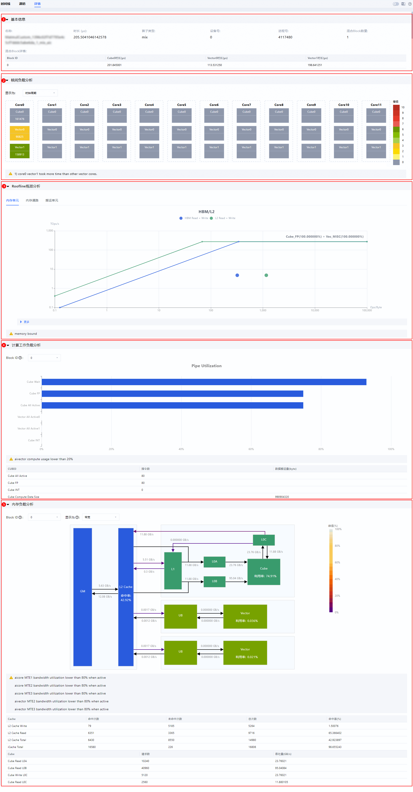

**基础信息（Base Info）**

区域一是基础信息（Base Info），可查看算子基础信息，包含名称、时长、类型等内容，详细说明如[**表 1**  基本信息字段说明](#基本信息字段说明)所示。

**表 1**  基本信息字段说明

|中文字段|英文字段|说明|
|--|--|--|
|名称|Name|算子名称。|
|时长 (μs)|Duration (μs)|算子总耗时。|
|算子类型|Op Type|算子类型。有mix、vector、cube和AiCore四种类型。|
|设备号|Device Id|设备id。|
|进程号|Pid|进程号。|
|Block数量|Block Dim|Sub Block的数量。当算子类型为vector、cube和AiCore时，为此参数名称。|
|混合Block数量|Mix Block Dim|Sub Block的数量。当算子类型为mix时，为此参数名称。|
|Block详情|Block Detail|Sub Block耗时详情。当算子类型为vector、cube和AiCore时，为此参数名称，其中字段解释如[**表 2**  Block详情字段说明](#Block详情字段说明)所示。|
|混合Block详情|Mix Block Detail|Sub Block耗时详情。当算子类型为mix时，为此参数名称，其中字段解释如[**表 3**  混合Block详情字段说明](#混合Block详情字段说明)所示。|

**表 2**  Block详情字段说明

|中文字段|英文字段|说明|
|--|--|--|
|Block ID|Block ID|Sub Block序号。当算子类型为AiCore时，无此参数。|
|计算核类型|Core Type|Sub Block类型。|
|时长(μs)|Duration (μs)|Sub Block耗时。|

**表 3**  混合Block详情字段说明

|中文字段|英文字段|说明|
|--|--|--|
|Block ID|Block ID|Sub Block序号。|
|Cube0时长(μs)|Cube0 Duration (μs)|AI Core的cube核耗时。|
|Vector0时长(μs)|Vector0 Duration (μs)|AI Core的其中一个vector核耗时。|
|Vector1时长(μs)|Vector1 Duration (μs)|AI Core的另外一个vector核耗时。|

**核间负载分析（Core Occupancy）**

区域二是核间负载分析（Core Occupancy），分别通过时钟周期数量、核总吞吐量、Cache命中率展示核间负载并进行分析，如[**图 2**  核间负载分析](#核间负载分析)所示。

可分别选择时钟周期（Cycles）、吞吐量（Throughput）或Cache命中率\(%\)（Cache Hit Rate\(%\)）显示Core的占用率，并展示分析结果，便于开发者定位分析异常点。

**图 2**  核间负载分析  
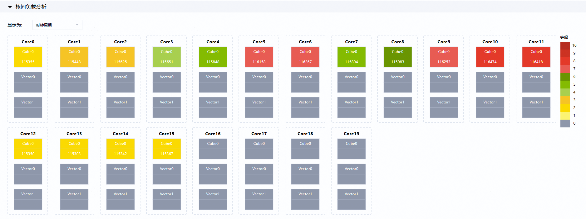

> [!NOTE] 说明  
> 
> - <term>Atlas A3 训练系列产品/Atlas A3 推理系列产品</term>、<term>Atlas A2 训练系列产品/Atlas A2 推理系列产品</term>和<term>Atlas 350 加速卡</term>导出的性能数据支持此模块。
> - 核间负载均衡度分为10个等级，其中4至6级表示均衡度接近平均值，而0至3级和7至10级表示均衡度与平均值存在较大差异。

**Roofline瓶颈分析（Roofline）**

区域三是Roofline瓶颈分析（Roofline），通过Roofline模型图展示算子性能，并对其结果进行分析，为开发者提供性能优化依据。Roofline模型图中的x轴为算数强度，单位是Ops/Byte，表示每字节（Byte）内存支持的操作次数；y轴为性能，单位是TOps/s，表示每秒钟可进行多少万亿次操作。

Roofline模型图上会显示算力名称，用于描述计算最大算力的指令类型组成，例如Cube\_INT\(100.000000%\) + Vec\_FP16\(30.000000%\),Vec\_FP32\(70.000000%\)，代表此时cube计算单元处理的全是int类型指令，vector计算单元处理的指令30%是fp16类型，70%是fp32类型。

>[!NOTE] 说明
> 
> - 仅<term>Atlas 350 加速卡</term>、<term>Atlas A3 训练系列产品/Atlas A3 推理系列产品</term>、<term>Atlas A2 训练系列产品/Atlas A2 推理系列产品</term>和<term>Atlas 推理系列产品</term>支持此模块。
> - 当导入<term>Atlas 350 加速卡</term>的数据时，Roofline模型图上将展示指令类型，可以结合图中参数进行筛选，以便查看Roofline模型图。

- 当硬件产品为<term>Atlas 350 加速卡</term>、<term>Atlas A3 训练系列产品/Atlas A3 推理系列产品</term>、<term>Atlas A2 训练系列产品/Atlas A2 推理系列产品</term>时，Roofline性能模型分析包含内存单元、内存通路以及搬运单元页签。

    **内存单元**：显示HBM/L2和Memory Unit模型图，如[**图 3**  内存单元](#内存单元)所示，参数解释如[**表 4**  内存单元参数说明](#内存单元参数说明)所示。

    **图 3**  内存单元  
    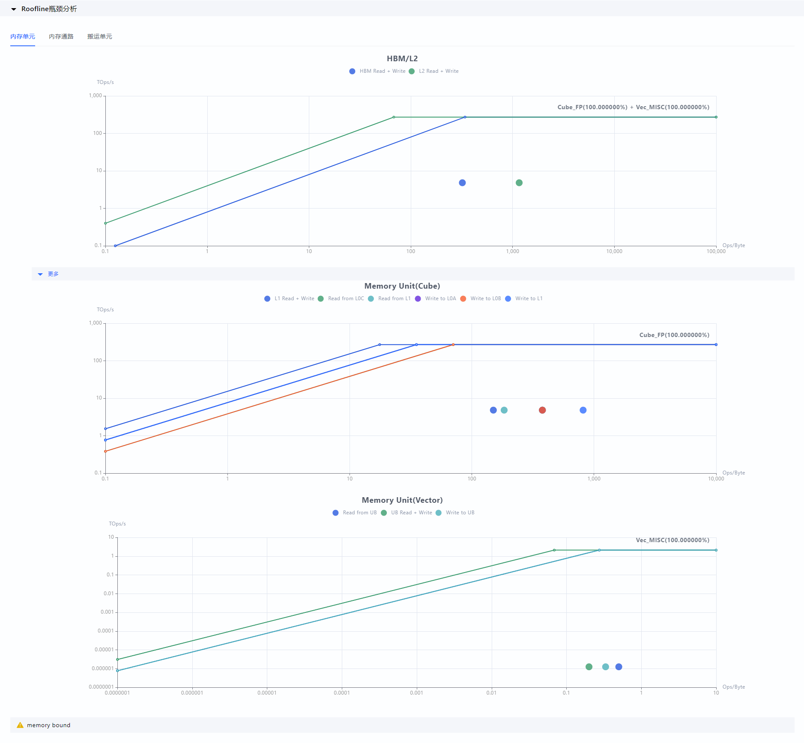

    **表 4**  内存单元参数说明

    |参数|说明|
    |--|--|
    |HBM Read + Write|高带宽存储器单元的读与写。|
    |L2 Read + Write|L2的读与写。|
    |L1 Read + Write|L1内存单元的读与写。|
    |Write to L1|写至L1内存单元。|
    |Read from L1|从L1内存单元的读。|
    |Write to L0A|写至L0A内存单元。|
    |Write to L0B|写至L0B内存单元。|
    |Read from L0C|从L0C内存单元的读。|
    |UB Read + Write|UB内存单元的读与写。|
    |Read from UB|从UB内存单元的读。|
    |Write to UB|写至UB内存单元。|
    |Vector Read UB|Vector从UB内存单元的读。|
    |Vector Write UB|Vector写至UB内存单元。|

    **内存通路**：显示内存搬运通路图，如[**图 4**  内存通路](#内存通路)所示，参数解释如[**表 5**  内存通路参数说明](#内存通路参数说明)所示。

    **图 4**  内存通路  
    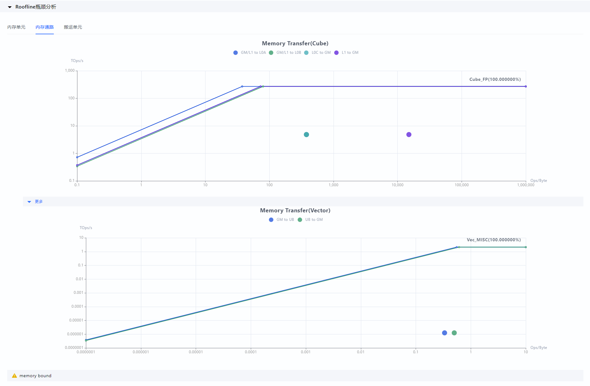

    **表 5**  内存通路参数说明

    |参数|说明|
    |--|--|
    |GM/L1 to L0A|GM/L1至L0A的内存通路。|
    |GM/L1 to L0B|GM/L1至L0B的内存通路。|
    |L0C to GM|L0C至GM的内存通路。|
    |L1 to GM|L1至GM的内存通路。|
    |L0C to L1|L0C至L1的内存通路。|
    |GM to UB|GM至UB的内存通路。|
    |UB to GM|UB至GM的内存通路。|

    **搬运单元**：显示Pipeline模型图，如[**图 5**  搬运单元](#搬运单元)所示，参数解释如[**表 6**  搬运单元参数说明](#搬运单元参数说明)所示。

    **图 5**  搬运单元   
    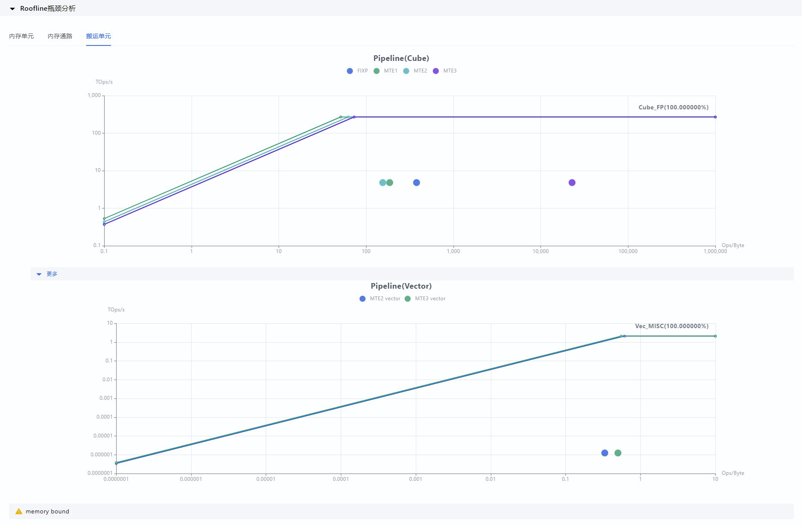

    **表 6**  搬运单元参数说明

    |参数|说明|
    |--|--|
    |MTE1|MTE1通路。|
    |MTE2|MTE2通路。|
    |MTE3|MTE3通路。|
    |FIXP|FIXP通路。|
    |MTE2 vector|Vector计算单元的MTE2通路。|
    |MTE3 vector|Vector计算单元的MTE3通路。|

- 当硬件产品为<term>Atlas 推理系列产品</term>时，仅存在内存单元内容，如[**图 6**  内存单元模型图](#内存单元模型图)所示，参数解释如[**表 7**  内存单元参数说明](#内存单元参数说明-1)所示。

    **图 6**  内存单元模型图  
    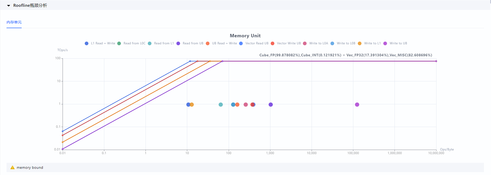

    **表 7**  内存单元参数说明

    |参数|说明|
    |--|--|
    |L1 Read + Write|L1内存单元的读与写。|
    |Read from L0C|从L0C内存单元的读。|
    |Read from L1|从L1内存单元的读。|
    |Read from UB|从UB内存单元的读。|
    |UB Read + Write|UB内存单元的读与写。|
    |Vector Read UB|Vector从UB内存单元的读。|
    |Vector Write UB|Vector写至UB内存单元。|
    |Write to L0A|写至L0A内存单元。|
    |Write to L0B|写至L0B内存单元。|
    |Write to L1|写至L1内存单元。|
    |Write to UB|写至UB内存单元。|

**计算工作负载分析（Compute Workload Analysis）**

区域四是计算工作负载分析（Compute Workload Analysis），以柱状图和数据窗格呈现方式查看相应信息，便于开发人员分析。如[**图 7**  计算工作负载分析](#计算工作负载分析)所示，参数解释如[**表 8**  计算工作负载分析参数说明](#计算工作负载分析参数说明)所示，柱状图和数据窗格的参数是依据实际采集的数据进行展示。图标中的内容为各个Block的计算负载分析结果。

**图 7**  计算工作负载分析  
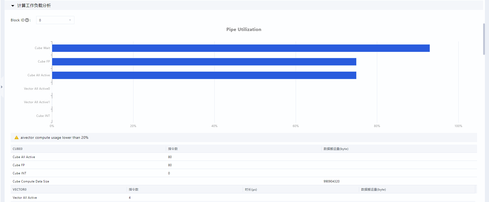

**表 8**  计算工作负载分析参数说明

|中文参数|英文参数|说明|
|--|--|--|
|Block ID|Block ID|Sub Block序号。可通过切换Block ID来查看对应信息。当算子类型为AiCore时，此参数显示NA，展示的是多核平均值。|
|Pipe Utilization|Pipe Utilization|Pipe（指令队列）可视化，以柱状图方式展示。  - 横坐标：Cycles占比，计算方式为Cycles/总的Cycles。Cycles为该指令在Sub Block上执行消耗的时钟周期。  - 纵坐标：算子指令，由bin文件的数据中提供。|
|CUBE|CUBE|cube类型的指令名称。当算子类型为cube时，显示此参数。|
|CUBE0|CUBE0|cube类型的指令名称。当算子类型为mix时，显示此参数。|
|VECTOR|VECTOR|vector类型的指令名称。当算子类型为vector时，显示此参数。|
|VECTOR0|VECTOR0|vector类型的指令名称。当算子类型为mix时，显示此参数。|
|VECTOR1|VECTOR1|vector类型的指令名称。当算子类型为mix时，显示此参数。|
|AICORE|AICORE|AiCore类型的指令名称。当算子类型为AiCore时，显示此参数。|
|指令数|Instructions|算子指令数量。|
|时长(μs)|Duration(μs)|算子指令耗时。|
|数据搬运量(byte)|Data Volume(byte)|算子指令数据量。|

**内存负载分析（Memory Workload Analysis）**

区域五是内存负载分析（Memory Workload Analysis），以内存热力图和数据窗格呈现方式查看相应信息，如[**图 8**  内存负载分析](#内存负载分析)所示，参数配置如[**表 9**  参数配置说明](#参数配置说明)所示，内存热力图和数据窗格的参数是依据实际采集的数据进行展示。热力图右侧的“峰值\(%\)”为箭头颜色，值为峰值带占比（最大带宽占比）。图标中的内容为各个Block的内存负载分析结果。

**图 8**  内存负载分析  
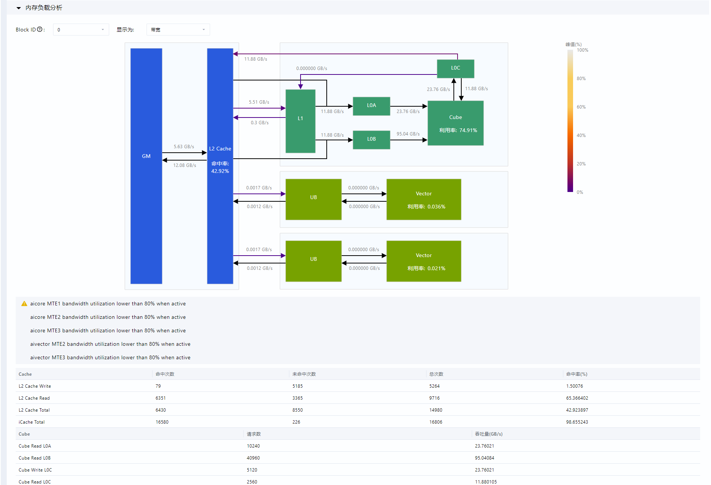

**表 9**  参数配置说明

|中文参数|英文参数|说明|
|--|--|--|
|Block ID|Block ID|Sub Block序号。在Block ID选框中可以选择想要查看的Sub Block。当算子类型为AiCore时，Block ID显示NA，展示的是多核平均值。|
|显示为|Show As|可选项，选择热力图连线箭头内容以请求数或者带宽展示。热力图箭头代表流向。  - 请求数（Num of Request）  - 带宽（Bandwidth）|

数据窗格呈现内容随算子类型而变化，其内容是基于bin文件的数据解析结果，具体呈现如下：

- 当算子类型为AiCore时，表格窗格参数解释如[**表 10**  AiCore类型参数说明](#AiCore类型参数说明)所示。

    **表 10**  AiCore类型参数说明

    |中文参数|英文参数|说明|
    |--|--|--|
    |Cache|Cache|L2缓存。|
    |Cube|Cube|cube计算单元。|
    |HBM|HBM|高带宽存储器单元。|
    |L0A|L0A|L0A储存单元。|
    |L0B|L0B|L0B储存单元。|
    |L0C|L0C|L0C储存单元。|
    |L1|L1|L1储存单元。|
    |Pipe|Pipe|计算通路。|
    |UB|UB|ub储存单元。|
    |Vector|Vector|vector计算单元。|
    |请求数|Requests|操作数量。|
    |吞吐量(GB/s)|Throughput(GB/s)|吞吐量，表示通路每秒的传输数据量，单位为GB/s。|

- 当算子类型为mix时，表格窗格参数解释如[**表 11**  mix类型参数说明](#mix类型参数说明)所示。

    **表 11**  mix类型参数说明

    |中文参数|英文参数|说明|
    |--|--|--|
    |Cache|Cache|L2缓存。|
    |命中次数|Hit|cache命中次数。|
    |未命中次数|Miss|cache未命中后重新分配缓存的次数。|
    |总次数|Total|cache请求总次数。|
    |命中率(%)|Hit Rate(%)|cache命中率。|
    |Cube|Cube|cube计算单元。|
    |HBM Cube|HBM Cube|cube单元的高带宽存储器单元。|
    |HBM Vector Core0|HBM Vector Core0|aicore内core0的vector单元的高带宽存储器单元。|
    |HBM Vector Core1|HBM Vector Core1|aicore内core1的vector单元的高带宽存储器单元。|
    |Scalar|Scalar|Scalar计算单元。|
    |Scalar Cube|Scalar Cube|cube单元的Scalar计算单元。|
    |Scalar Vector Core0|Scalar Vector Core0|aicore内core0的vector单元的Scalar计算单元。|
    |Scalar Vector Core1|Scalar Vector Core1|aicore内core1的vector单元的Scalar计算单元。|
    |L0A|L0A|L0A储存单元。|
    |L0B|L0B|L0B储存单元。|
    |L0C|L0C|L0C储存单元。|
    |L1|L1|L1储存单元。|
    |请求数|Requests|操作数量。|
    |吞吐量(GB/s)|Throughput(GB/s)|吞吐量，表示通路每秒的传输数据量，单位为GB/s。|
    |峰值（最大带宽占比）(%)|Peak(%)|与理论带宽的比率。|
    |Pipe Cube|Pipe Cube|cube单元的计算通路。|
    |Pipe Vector Core0|Pipe Vector Core0|aicore内core0的vector单元的计算通路。|
    |Pipe Vector Core1|Pipe Vector Core1|aicore内core1的vector单元的计算通路。|
    |指令数|Instructions|指令数量。|
    |时钟周期|Cycle|通路消耗的时钟周期。|
    |Time(us)|Time(us)|Scalar计算单元的运行时间。|
    |等待周期|Wait Cycles|对应pipe上被阻塞的cycle数。|
    |活跃率（%）|Active Rate(%)|运行cycle数占总的cycle的百分比。|
    |UB Core0|UB Core0|mix算子aicore内core0的ub储存单元。|
    |UB Core1|UB Core1|mix算子aicore内core1的ub储存单元。|
    |Vector Core0|Vector Core0|vector计算单元。|
    |Vector Core1|Vector Core1|vector计算单元。|

- 当算子类型为vector时，表格窗格参数解释如[**表 12**  vector类型参数说明](#vector类型参数说明)所示。

    **表 12**  vector类型参数说明

    |中文参数|英文参数|说明|
    |--|--|--|
    |Cache|Cache|L2缓存。|
    |命中次数|Hit|cache命中次数。|
    |未命中次数|Miss|cache未命中后重新分配缓存的次数。|
    |总次数|Total|cache请求总次数。|
    |命中率(%)|Hit Rate(%)|cache命中率。|
    |HBM|HBM|高带宽存储器单元。|
    |Scalar|Scalar|Scalar计算单元。|
    |请求数|Requests|操作数量。|
    |吞吐量(GB/s)|Throughput(GB/s)|吞吐量，表示通路每秒的传输数据量，单位为GB/s。|
    |Pipe|Pipe|计算通路。|
    |指令数|Instructions|指令数量。|
    |时钟周期|Cycle|通路消耗的时钟周期。|
    |Time(us)|Time(us)|Scalar计算单元的运行时间。|
    |等待周期|Wait Cycles|对应pipe上被阻塞的cycle数。|
    |活跃率（%）|Active Rate(%)|运行cycle数占总的cycle的百分比。|
    |UB|UB|ub储存单元。|
    |Vector|Vector|vector计算单元。|
    |峰值（最大带宽占比）(%)|Peak(%)|与理论带宽的比率。|

- 当算子类型为cube时，表格窗格参数解释如[**表 13**  cube类型参数说明](#cube类型参数说明)所示。

    **表 13**  cube类型参数说明

    |中文参数|英文参数|说明|
    |--|--|--|
    |Cache|Cache|L2缓存。|
    |命中次数|Hit|cache命中次数。|
    |未命中次数|Miss|cache未命中后重新分配缓存的次数。|
    |总次数|Total|cache请求总次数。|
    |命中率(%)|Hit Rate(%)|cache命中率。|
    |Cube|Cube|cube计算单元。|
    |HBM|HBM|高带宽存储器单元。|
    |Scalar|Scalar|Scalar计算单元。|
    |L0A|L0A|L0A储存单元。|
    |L0B|L0B|L0B储存单元。|
    |L0C|L0C|L0C储存单元。|
    |L1|L1|L1储存单元。|
    |请求数|Requests|操作数量。|
    |吞吐量(GB/s)|Throughput(GB/s)|吞吐量，表示通路每秒的传输数据量，单位为GB/s。|
    |峰值（最大带宽占比）(%)|Peak(%)|与理论带宽的比率。|
    |Pipe|Pipe|计算通路。|
    |指令数|Instructions|指令数量。|
    |时钟周期|Cycle|通路消耗的时钟周期。|
    |Time(us)|Time(us)|Scalar计算单元的运行时间。|
    |等待周期|Wait Cycles|对应pipe上被阻塞的cycle数。|
    |活跃率（%）|Active Rate(%)|运行cycle数占总的cycle的百分比。|

### 使用说明

**查看Cycles**

在“Pipe Utilization”柱状图区域，鼠标滚动至对应指令柱状图上，会显示真实Cycles信息。如[**图 1**  查看Cycles](#查看Cycles)所示。

**图 1**  查看Cycles  
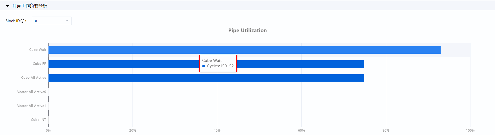

**在Roofline模型性能图中查看算子性能**

在“Roofline瓶颈分析”区域的内存单元、内存通路或搬运单元的任意一个视图中，选择视图中对应的参数点，可悬浮显示该内存单元实际的性能信息，如[**图 2**  显示算子性能信息](#显示算子性能信息)所示，参数解释如[**表 1**  性能信息参数说明](#性能信息参数说明)所示。

**图 2**  显示算子性能信息  
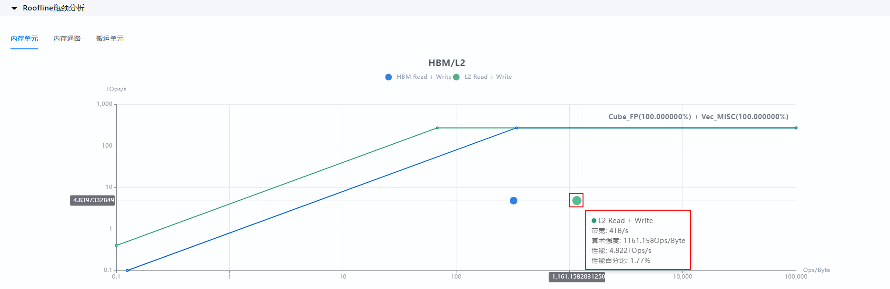

**表 1**  性能信息参数说明

|中文参数|英文参数|说明|
|--|--|--|
|带宽|Bandwidth|硬件的带宽上限。|
|算术强度|Arithmetic Intensity|对应x轴，表示单位内存可以支持的操作次数。|
|性能|Performance|对应y轴，表示单位时间的操作次数，每秒钟可进行多少万亿次操作。|
|性能百分比|Performance Ratio|性能百分比 = 算子运行的实际性能 / 硬件最佳性能。|

**支持算子间性能对比**

MindStudio Insight支持两算子间详情对比，可帮助开发者直观明了地查看两个算子间的差异，便于分析。进行算子详情比对前需要先设置基线算子和对比算子，设置操作可参考[数据对比](./basic_operations.md#管理数据)。

在算子对比模式下，详情（Details）界面分别从基础信息（Base Info）、核负载分析（Core Occupancy）、计算工作负载分析（Compute Workload Analysis）、内存负载分析（Memory Workload Analysis）方面呈现对比数据。算子对比功能仅支持同类型的算子进行对比。

- 基础信息（Base Info）：对算子间的基础信息进行对比。
- 核间负载分析（Core Occupancy）：以对比数据为基准，如果对比数据中有核间负载分析数据，则界面支持显示；如果对比数据中无核间负载分析数据，则界面不显示核间负载分析内容。
- Roofline瓶颈分析（Roofline）：此模块暂不支持对比，如果对比数据中有此模块，在算子对比模式下，会显示对比数据中的内容。
- 计算工作负载分析（Compute Workload Analysis）：以柱状图和数据窗格呈现方式查看相应信息，柱状图中蓝色为对比数据，绿色为基线数据，数据窗格显示算子间的对比差异，单击“详情”列中“查看更多”，可展示基线数据和对比数据的详情，如[**图 3**  计算工作负载分析对比](#计算工作负载分析对比)所示。

    **图 3**  计算工作负载分析对比  
    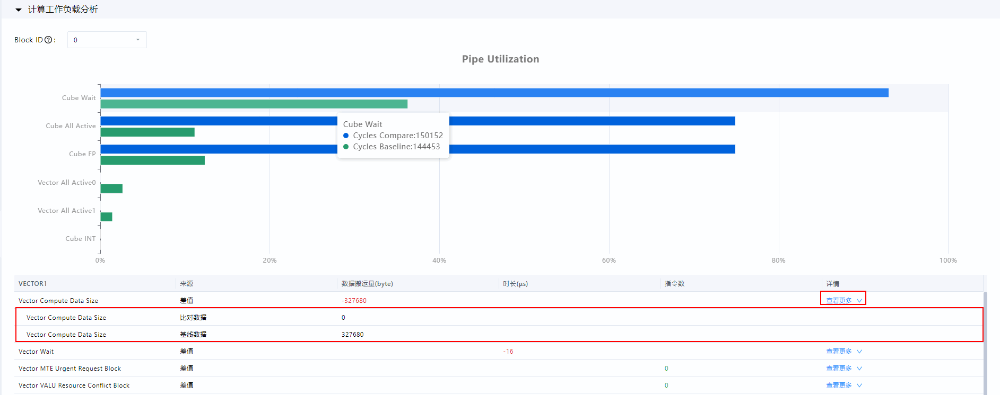

- 内存负载分析（Memory Workload Analysis）：以内存热力图和数据窗格呈现方式查看相应信息，热力图中括号里的数据为基线数据，括号外的数据为对比数据，数据窗格显示算子间的对比差异，单击“详情”列中“查看更多”，可展示基线数据和对比数据的详情，如[**图 4**  内存负载分析对比](#内存负载分析对比)所示。

    **图 4**  内存负载分析对比  
    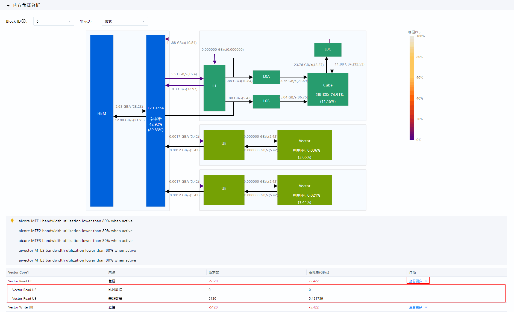

## 缓存（Cache）

### 功能说明

缓存（Cache）界面支持展示用户程序Kernel函数内的L2 Cache访问情况，以便用户优化Cache命中率。

### 界面介绍

缓存（Cache）界面主要展示用户程序Kernel函数内的L2 Cache访问情况，如[**图 1**  缓存界面](#缓存界面)所示。单击缓存（Cache）界面中的任意一个图，可将所选图放大查看。

选择单个内存单元，可显示该内存单元的详情，包括缓存行索引、事件次数和事件占比。

**图 1**  缓存界面  
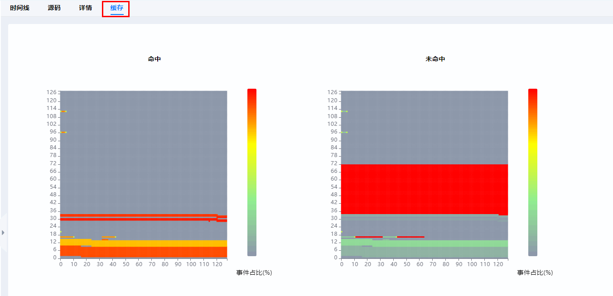

### 使用说明

**事件图支持与源码联动**

在缓存（Cache）界面，选择命中和未命中事件图，单击放大，在放大的事件图中右键单击所选内存单元格，选择“显示指令”，可跳转至源码（Source）界面，并高亮显示与之相关的指令行，如[**图 1**  跳转指令表](#跳转指令表)所示。

**图 1**  跳转指令表  
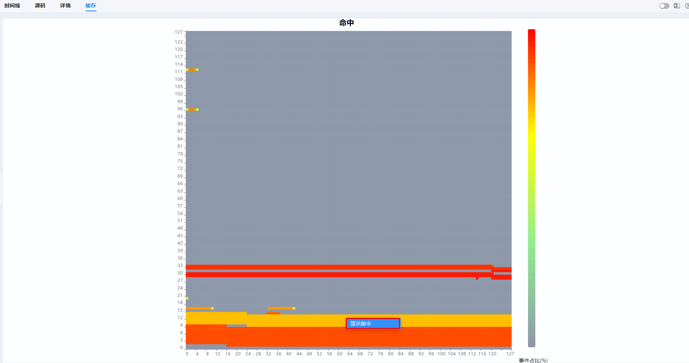

## 算子调优-内存轨迹分析（Triton）

### 功能说明

算子调优-内存轨迹分析（Triton）界面支持展示内存分布情况，便于用户了解在指定时间区间内的内存分布情况以及对应时间点的内存分布详情，分析UB（Unified Buffer）内存出现溢出的问题。

### 界面介绍

导入指定目录下的`memory_info.json`文件，出现算子调优-内存轨迹分析（Triton）界面，展示指定时间范围内的内存分布情况，其中共有三个区域，如[**图1**  算子调优-内存轨迹分析界面](#算子调优-内存轨迹分析界面)所示。

**图1**  算子调优-内存轨迹分析界面
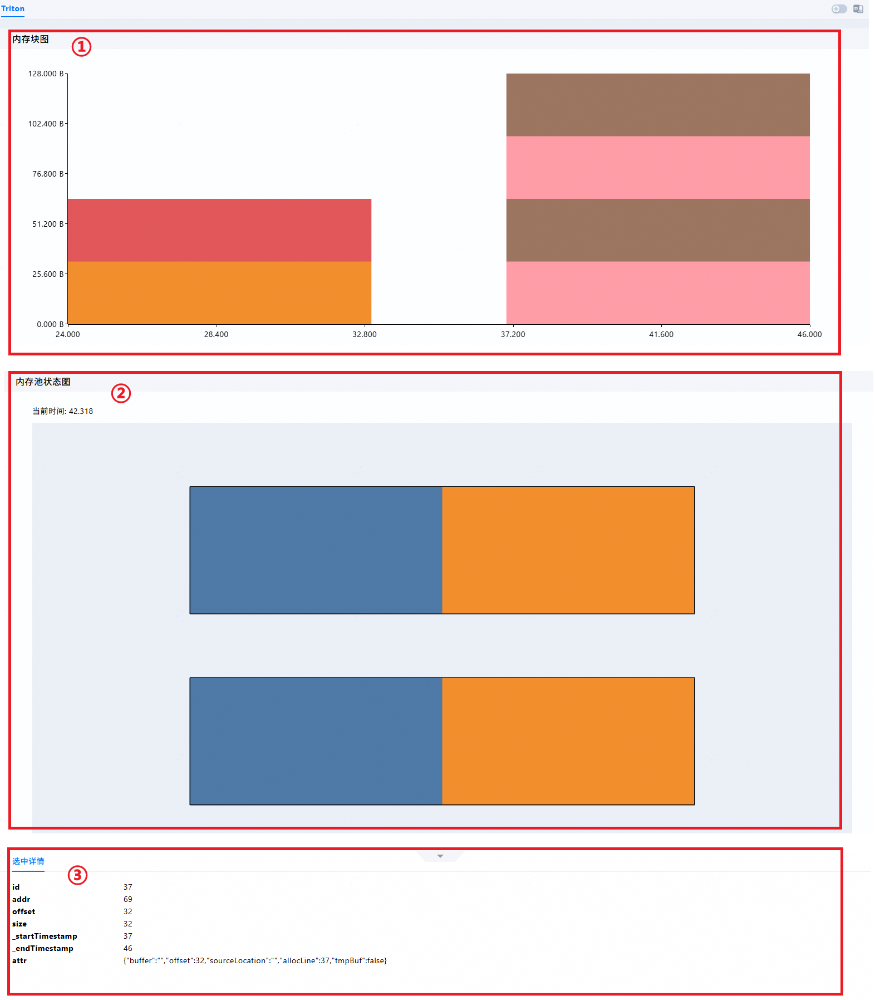

 - 区域一，内存块图，查看当前时间范围内的内存分布情况。
 - 区域二，内存池状态图，当鼠标置于“内存块图”中，会显示一条时间线，在“内存块图”区域，单击时间线，会展示对应时间点的切片内存池状态图，展示该时间节点的内存分布情况。
 - 区域三，选中详情，单击内存块图以及内存池状态图的任意图块，将会展示该块图的切片详情信息。

### 使用说明

导入指定目录下的`memory_info.json`文件，界面出现内存块图，如[**图2**  算子调优-内存块图](#算子调优-内存块图)所示。

**图2**  算子调优-内存块图
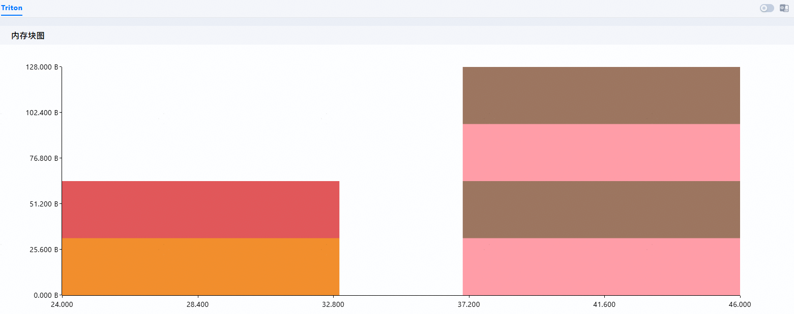

点击[**图2**  算子调优-内存块图](#算子调优-内存块图)中任意时间节点对应的图块，将在下方展示该时间点的内存池状态图，如[**图3**  内存池状态图](#内存池状态图)所示。

**图3**  内存池状态图
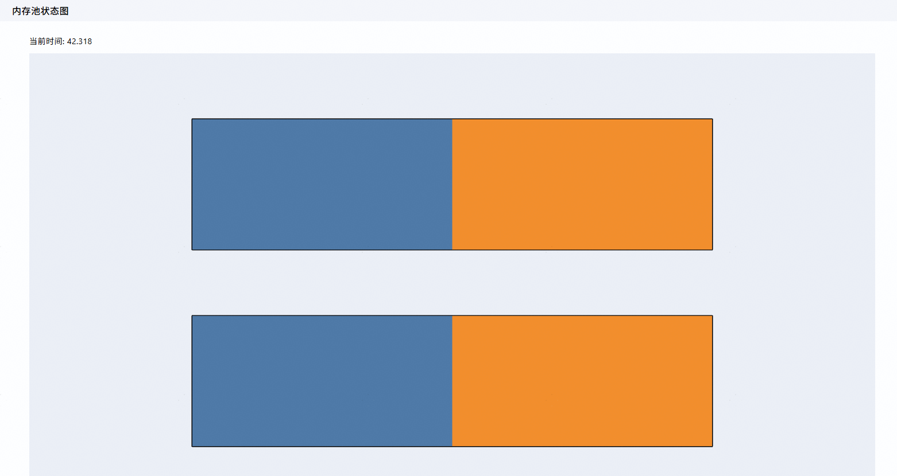

点击[**图2**  算子调优-内存块图](#算子调优-内存块图)或者[**图3**  内存池状态图](#内存池状态图)中的色块，将在下方区域展示对应的具体时间切片详情，如[**图4**  选中详情](#选中详情)所示。

  > [!NOTE] 说明  
  > 选中详情默认不展示，需要查看时点击选中详情区域上方中间的**展开按钮**，展开展示选中详情；再次点击**收起按钮**，隐藏选中详情。

**图4**  选中详情
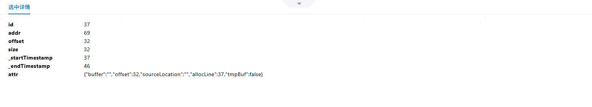
