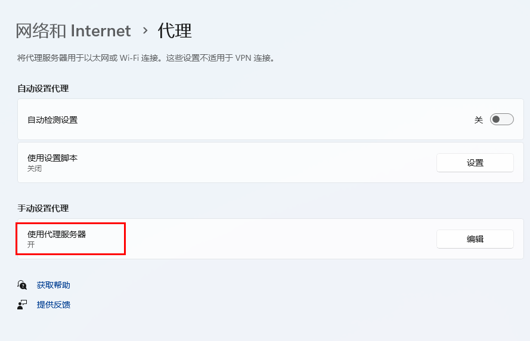
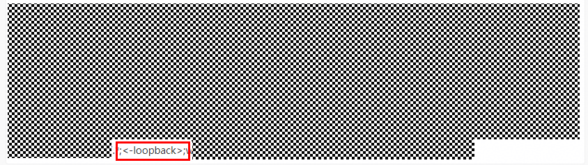

# MindStudio Insight断连问题修复

## 1. 断连问题

### 1.1 启动MindStudio Insight后，马上断连

**Q：**

WebSocket is already in CLOSING or CLOSED state! You are advised to restart MindStudio Insight.

**A：**

1. 首先排查是否代理设置问题，进入主机设置界面，查看***网络代理和Internet>代理>手动设置代理***；
   
   
2. 点击编辑进行查看；

   
3. 查看上图代理白名单中是否有**<-loopback>**关键字，如果有的话删除后保存；
   
   
4. 若去掉该白名单后影响本地web的一些访问，可以增加关键字，然后重新打开Insight工具进行使用；
5. 若不存在该关键字且修改后无效，可联系Insight工具接口人进一步定位。
   