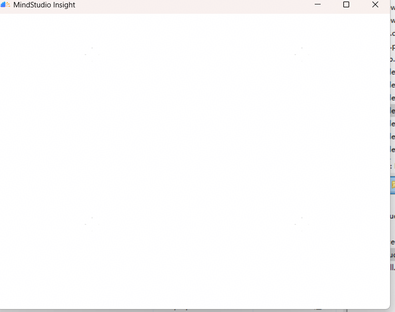
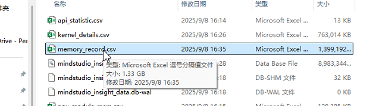

# 白屏问题汇总

## MindStudio打开白屏

### 问题描述

版本:MindStudio 8.2.RC1.B120

系统:win11

### 解决方法

使用前后端分离启动的方式可以临时解决。

---

## 加载内存时白屏

### 问题描述

### 解决方法

【错误原因】

折线图数据源memory_record.csv过大，达到1.3G，导致页面OOM.

【解决方案】

Insight 8.3 优化内存页面。
