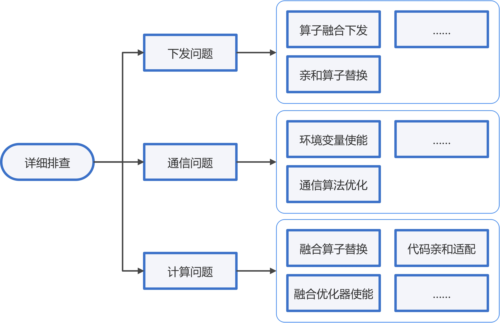
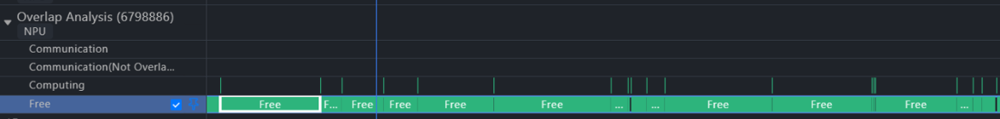
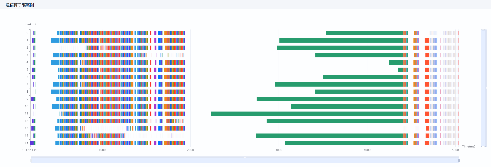
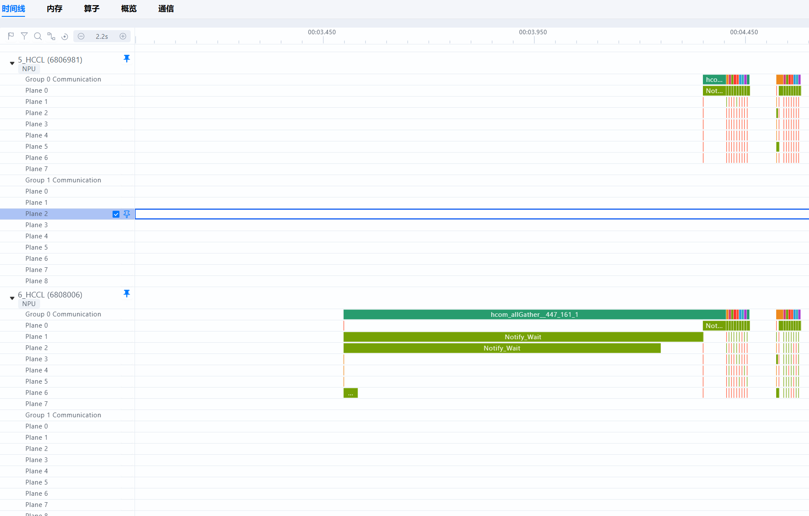
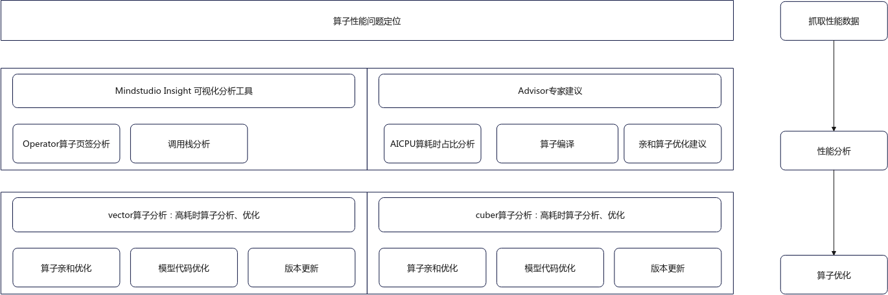

# 性能问题排查

> 来源: [https://www.hiascend.com/document/detail/zh/mindstudio/830/practicalcases/GeneralPerformanceIssue/toolsample6_008.html?framework=pytorch](https://www.hiascend.com/document/detail/zh/mindstudio/830/practicalcases/GeneralPerformanceIssue/toolsample6_008.html?framework=pytorch)

# 详细排查

详细排查主要围绕下发、通信、计算三类常见问题开展，性能工具的使用请参见[模型调优工具](https://www.hiascend.com/document/detail/zh/mindstudio/830/practicalcases/GeneralPerformanceIssue/toolsample6_011.html?framework=pytorch)。

  * 使用msprof-analyze工具初步分析，粗粒度定位性能问题，并为后续的深入分析提供明确的方向，具体请参见[模型调优快速分析（msprof-analyze命令行工具）](https://www.hiascend.com/document/detail/zh/mindstudio/830/practicalcases/GeneralPerformanceIssue/toolsample6_014.html?framework=pytorch)。
  * 通过MindStudio Insight工具进一步识别瓶颈点，深入剖析问题根源。具体请参见[模型调优深入分析（MindStudio Insight）](https://www.hiascend.com/document/detail/zh/mindstudio/830/practicalcases/GeneralPerformanceIssue/toolsample6_015.html?framework=pytorch)。

**图1** 详细排查流程图   

#### 下发问题

下发问题是指算子下发过程耗时异常。下发指Graph Engine将算子执行请求下发至Runtime，Runtime判断算子的Task类型，根据类型将算子执行请求下发到Device上执行，详细说明请参考《[TBE&AI CPU算子开发指南](https://www.hiascend.com/document/detail/zh/canncommercial/850/opdevg/tbeaicpudevg/atlasopdev_10_0001.html)》中的[算子编译运行流程](https://www.hiascend.com/document/detail/zh/canncommercial/850/opdevg/tbeaicpudevg/atlasopdev_10_0012.html)章节。

理想情况下，NPU侧的计算流水不停运转，不会出现NPU等待CPU的场景，一旦出现下发延迟，将导致流水线阻塞，从而影响AI Core的算力利用率。此时即判定存在下发问题。下发问题主要通过MindStudio Insight工具中[时间线（Timeline）](https://www.hiascend.com/document/detail/zh/mindstudio/830/practicalcases/GeneralPerformanceIssue/toolsample6_022.html?framework=pytorch)进行观察，若存在下列任一现象，请参考[下发异常分析](https://www.hiascend.com/document/detail/zh/mindstudio/830/practicalcases/GeneralPerformanceIssue/toolsample6_075.html?framework=pytorch)进行分析。

  * 覆盖Free Time占比过大：Overlap Analysis中Free Time占比远超Computing和Communication。理想的Free Time占比应在10%以内。 

**图2** 查看Free   

  * 红框中的HostToDevice连线接近垂直，且蓝框中的Device上相对空闲。 

**图3** 查看连线   

  * HostToDevice频繁拷贝打断异步流水，造成下发瓶颈。 

**图4** 寻找下发瓶颈   

#### 通信问题

通信问题一般指NPU卡间通信存在异常，典型表现为快慢卡或通信带宽远不及预期，具体情况请参见MindStudio Insight的[集群性能分析](https://www.hiascend.com/document/detail/zh/mindstudio/830/practicalcases/GeneralPerformanceIssue/toolsample6_018.html?framework=pytorch)，解决方法请参考[通信问题优化方案](https://www.hiascend.com/document/detail/zh/mindstudio/830/practicalcases/GeneralPerformanceIssue/toolsample6_028.html?framework=pytorch)。 

在大集群场景中，全量集群的Profiling可能会数据量过大，不利于分析，建议使用[模型调优快速分析（msprof-analyze命令行工具）](https://www.hiascend.com/document/detail/zh/mindstudio/830/practicalcases/GeneralPerformanceIssue/toolsample6_014.html?framework=pytorch)中的cluster_analyze（集群分析）工具先对全量Profiling做一遍集群分析，将交付件cluster_analysis_output目录导入MindStudio Insight，观察是否存在明显快慢卡或通信传输问题，再挑选部分感兴趣卡的Profiling，从单卡维度分析。

  * 图5为MindStudio Insight通信（Communication）界面中的“通信耗时分析”功能，其中每一个色块代表一个集合通信算子，其长度代表通信算子的执行时间。如果对于某个集合通信算子，不同卡间通信算子执行时间差距非常大，说明通信算子耗时最短的那张卡是慢卡（其他卡都在等此慢卡）。 

**图5** 利用MindStudio Insight的通信耗时分析查找慢卡   

  * 在Timeline中可以看到明显的卡间等待，如图6中红框所示，快卡Rank6已经计算完毕，在等待慢卡Rank5完成计算。 

**图6** Timeline对比快慢卡Profiling（Ascend Hardware层）   

  * 如图7所示，Communication泳道可观察到，快卡Rank6的hcom_allGather通信算子时长远大于慢卡Rank5的通信算子，且主要时长来源于同步等待。 

**图7** Timeline对比快慢卡Profiling（Communication泳道）   

#### 计算问题

计算问题，即算子性能问题，是深度学习模型中的一个关键挑战，具体表现为部分基础计算单元的执行效率低下，从而影响整个模型的运行速度并造成资源浪费。这类问题需要借助专门的分析工具和代码优化技术来解决。例如，在评估融合算子性能时，可以通过对比不同配置下的计算时间、内存使用量等指标来进行综合判断。具体请参考[算子性能问题优化方案](https://www.hiascend.com/document/detail/zh/mindstudio/830/practicalcases/GeneralPerformanceIssue/toolsample6_048.html?framework=pytorch)来定位与解决。

**图8** 算子性能问题定位   

**父主题：** [排查思路介绍](https://www.hiascend.com/document/detail/zh/mindstudio/830/practicalcases/GeneralPerformanceIssue/toolsample6_006.html?framework=pytorch)
