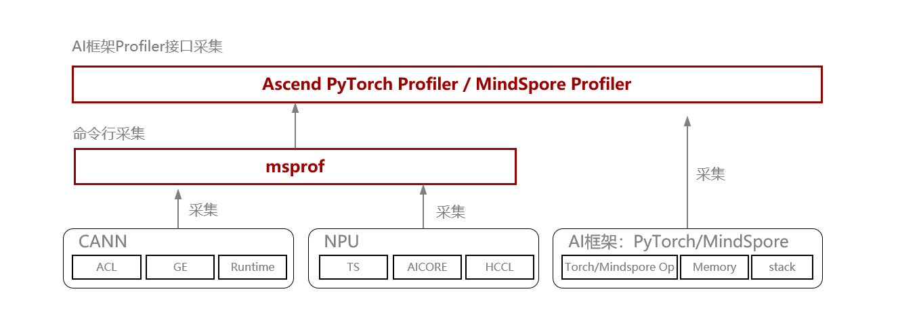

# 模型调优性能采集工具

> 来源: [https://www.hiascend.com/document/detail/zh/mindstudio/830/practicalcases/GeneralPerformanceIssue/toolsample6_013.html?framework=pytorch](https://www.hiascend.com/document/detail/zh/mindstudio/830/practicalcases/GeneralPerformanceIssue/toolsample6_013.html?framework=pytorch)

# 模型调优性能采集工具

MindStudio提供多种灵活的系统级性能数据采集方式，可根据实际需求选择合适的方案，以精准定位性能瓶颈并提升训练效率。

按照使能方式可以分为命令行采集（msprof）和AI框架Profiler接口采集（Ascend PyTorch Profiler，MindSpore Profiler）两大类。

msprof命令行工具主要采集CANN层与NPU层性能数据，是其它采集接口的底座。

msprof命令行工具无AI框架层数据。

AI框架Profiler接口封装了msprof命令行工具，进一步增加了对AI框架层性能数据的采集与解析，是**最常用的采集方式** 。AI框架Profiler接口按照功能特性，可进一步分为常规采集（即静态采集）、动态采集、在线监测三种模式。

此外，部分训练或推理套件会对AI框架Profiler接口进行进一步封装，可直接通过套件内接口调用，例如[MindSpeed-MM](https://gitee.com/ascend/MindSpeed-MM/tree/master/mindspeed_mm/tools#profiling采集工具)、[MindFormers](https://www.mindspore.cn/mindformers/docs/zh-CN/r1.3.2/perf_optimize/perf_optimize.html#profiler工具)等。

**图1** 性能采集框架  

**表1** 采集方式说明**采集方式** | **特点** | **推荐使用场景** | 文档参考链接  
---|---|---|---  
msprof命令行采集 | msprof命令行工具提供了AI任务运行性能数据、昇腾AI处理器系统数据等性能数据的采集和解析能力。 说明： msprof命令行工具无AI框架层数据。 | 训练、推理场景下均可使用。 | 《[性能调优工具用户指南](https://www.hiascend.com/document/detail/zh/mindstudio/830/T&ITools/Profiling/atlasprofiling_16_0001.html)》中的“[msprof采集通用命令](https://www.hiascend.com/document/detail/zh/mindstudio/830/T&ITools/Profiling/atlasprofiling_16_0008.html)章节。  
Ascend PyTorch Profiler接口采集 | 完全对标PyTorch-GPU场景下的使用方式，支持采集PyTorch框架和昇腾软硬件数据。 | 基于PyTorch的常规性能分析。 | 《[性能调优工具用户指南](https://www.hiascend.com/document/detail/zh/mindstudio/830/T&ITools/Profiling/atlasprofiling_16_0001.html)》中的“[Ascend PyTorch调优工具](https://www.hiascend.com/document/detail/zh/mindstudio/830/T&ITools/Profiling/atlasprofiling_16_0121.html)”章节。  
MindSpore Profiler接口采集 | 支持采集MindSpore框架和昇腾软硬件数据。 | 基于MindSpore的常规性能分析。 | 《[性能调优工具用户指南](https://www.hiascend.com/document/detail/zh/mindstudio/830/T&ITools/Profiling/atlasprofiling_16_0001.html)》中的[MindSpore调优工具](https://www.hiascend.com/document/detail/zh/mindstudio/830/T&ITools/Profiling/atlasprofiling_16_0118.html)章节。  
  
使用AI框架Profiler采集时，可以参考表2信息配置参数。

**表2** 参数配置使用场景 | 配置参数  
---|---  
常规性能分析场景 | 

  * profiler_level=Level1
  * aic_metrics保持默认，取值PipeUtilization

  * activities设置采集CPU和NPU
  * 其他开关根据需要开启

  
NPU/GPU对比场景 | 该配置用于对比NPU和GPU端到端耗时：

  * profiler_level=Level0
  * activities设置仅采集NPU或CPU和NPU（根据需要）

  * 其他开关关闭

  
定位代码位置场景 | 如果需要定位异常算子代码位置，可在常规场景下开启with_stack或with_modules开关，用以开启调用栈（非必要不开启，性能会膨胀）。  
分析算子NPU片上内存申请情况 | profile_memory=True  
分析集群通信情况 | profiler_level=Level1  
  
按照功能特性区分，可以区分为常规采集、动态采集、轻量化性能数据在线监测三大类，如表3所示。

**表3** 采集分类**采集方式** | **特点** | **推荐使用场景** | **使用指导**  
---|---|---|---  
常规采集 | 预先设置采集周期或全量采集，落盘详细性能数据。 | 常规性能分析 | 

  * Ascend PyTorch Profiler：请参考《[性能调优工具用户指南](https://www.hiascend.com/document/detail/zh/mindstudio/830/T&ITools/Profiling/atlasprofiling_16_0001.html)》中的“[Ascend PyTorch调优工具](https://www.hiascend.com/document/detail/zh/mindstudio/830/T&ITools/Profiling/atlasprofiling_16_0121.html)”章节。
  * MindSpore Profiler：请参考《[性能调优工具用户指南](https://www.hiascend.com/document/detail/zh/mindstudio/830/T&ITools/Profiling/atlasprofiling_16_0001.html)》中的[MindSpore调优工具](https://www.hiascend.com/document/detail/zh/mindstudio/830/T&ITools/Profiling/atlasprofiling_16_0118.html)章节。

  * msprof：请参考《[性能调优工具用户指南](https://www.hiascend.com/document/detail/zh/mindstudio/830/T&ITools/Profiling/atlasprofiling_16_0001.html)》中的“[msprof采集通用命令](https://www.hiascend.com/document/detail/zh/mindstudio/830/T&ITools/Profiling/atlasprofiling_16_0008.html)章节。

  
dynamic_profile动态采集 | 在执行模型训练过程中可以**随时开启采集进程** 、**动态修改配置采集项** ，无需频繁改动脚本代码。 | 启停成本高的场景（如超大规模训练）  
  
**父主题：** [模型调优工具](https://www.hiascend.com/document/detail/zh/mindstudio/830/practicalcases/GeneralPerformanceIssue/toolsample6_011.html?framework=pytorch)
