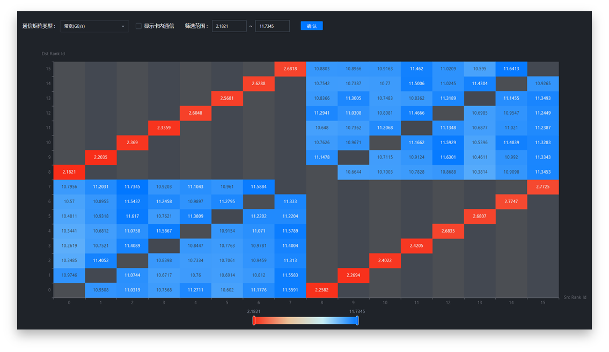
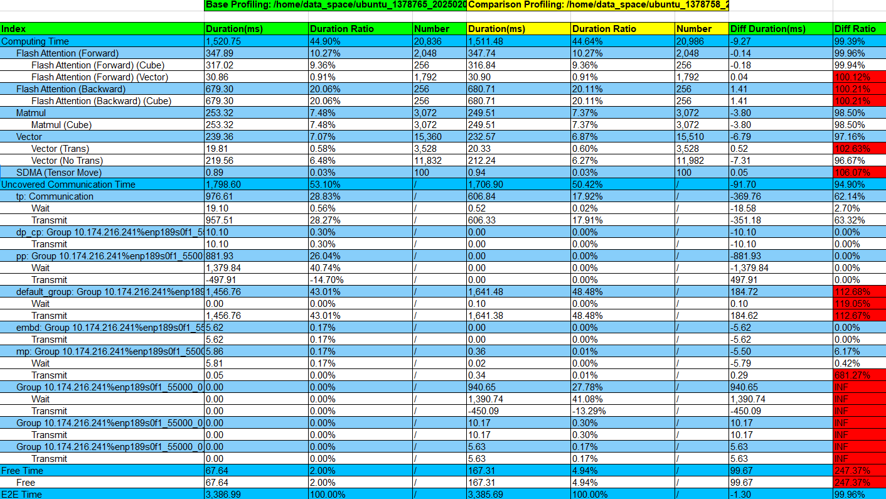
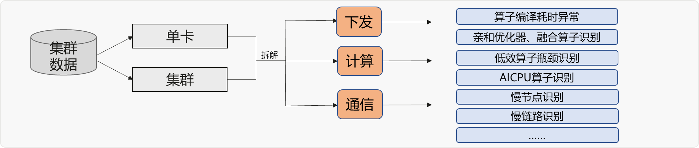
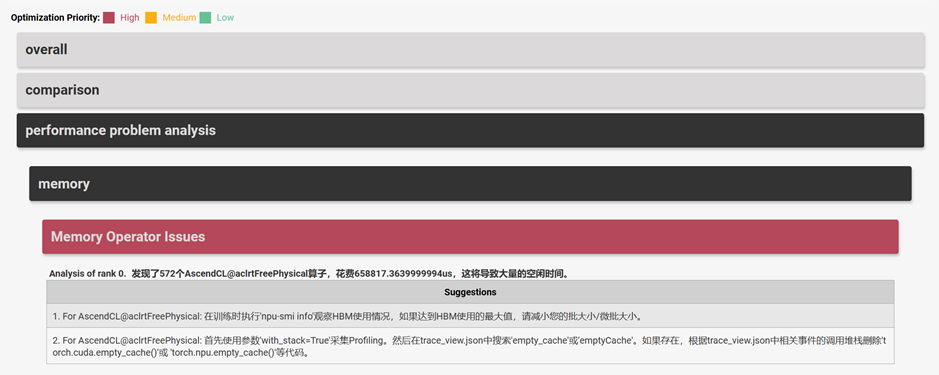

# 模型调优快速分析

> 来源: [https://www.hiascend.com/document/detail/zh/mindstudio/830/practicalcases/GeneralPerformanceIssue/toolsample6_014.html?framework=pytorch](https://www.hiascend.com/document/detail/zh/mindstudio/830/practicalcases/GeneralPerformanceIssue/toolsample6_014.html?framework=pytorch)

# 模型调优快速分析（msprof-analyze命令行工具）

针对AI作业中的性能瓶颈，[msprof-analyze工具](https://gitee.com/ascend/mstt/tree/master/profiler/msprof_analyze)提供快速分析的命令行工具，包含三个核心能力，如表1所示。

**表1** msprof-analyze工具的核心能力**工具名称** | **功能** 介绍  
---|---  
cluster_analyze（集群分析） | 提供慢节点、慢卡、慢链路定位的能力，可结合MindStudio Insight可视化工具使用。  
compare（性能拆解比对） | 提供NPU与GPU以及两个NPU之间，算子在时间和内存维度上的比对能力，帮助用户快速定位问题算子。  
advisor（专家建议） | 结合性能调优专家经验和昇腾软硬件对算子的亲和适配，提供自动化调优能力，帮助用户识别性能瓶颈，并给出优化建议。  
  
  * cluster_analyze（集群分析）

cluster_analyze（集群分析）结果通过MindStudio Insight可视化工具展示，辅助进行通信矩阵与通信耗时分析。

**图1** 利用MindStudio Insight可视化集群分析结果示意图  

  * compare性能比对

compare工具将耗时拆解为**算子执行、通信（非计算掩盖部分）、调度开销、内存占用** 四大核心维度，帮助精准定位性能瓶颈。

**图2** compare工具分析结果报告示意图  

  * advisor专家建议

advisor专家建议工具自动化识别性能瓶颈点，并给出优化建议。覆盖集群和单卡场景的下发、计算、通信等维度，端到端帮助用户分析Profiling数据。

**图3** advisor专家建议工具主要功能  

advisor工具将优化建议按紧急程度分级，其中红色标注代表最高优先级，需优先处理。

**图4** advisor专家建议工具分析结果报告示意图  

**父主题：** [模型调优工具](https://www.hiascend.com/document/detail/zh/mindstudio/830/practicalcases/GeneralPerformanceIssue/toolsample6_011.html?framework=pytorch)
