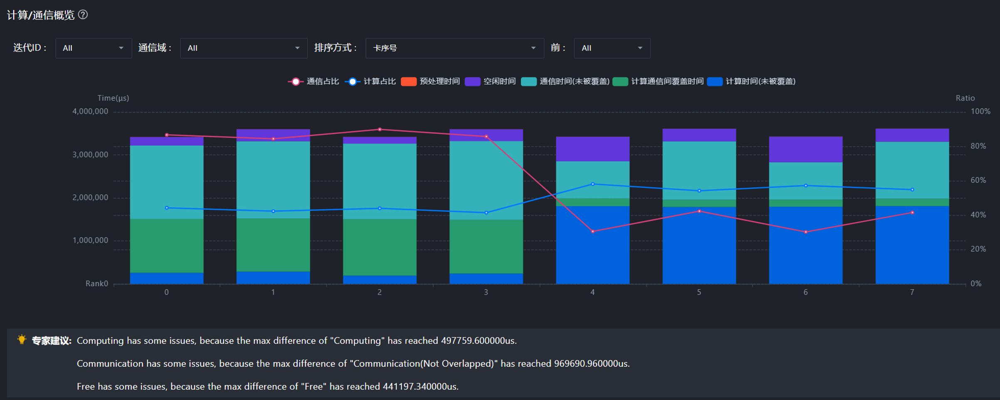
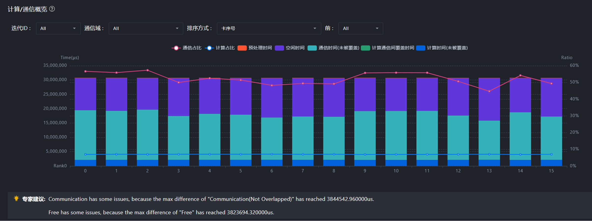
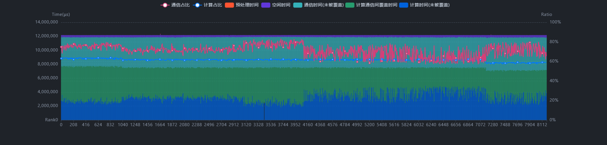
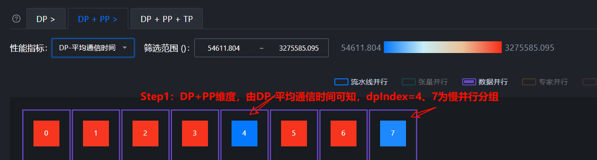
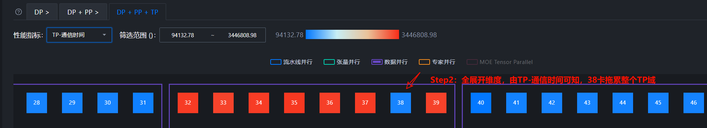
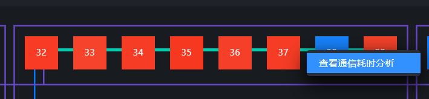

# 通信问题

> 来源: [https://www.hiascend.com/document/detail/zh/mindstudio/830/practicalcases/GeneralPerformanceIssue/toolsample6_019.html?framework=pytorch](https://www.hiascend.com/document/detail/zh/mindstudio/830/practicalcases/GeneralPerformanceIssue/toolsample6_019.html?framework=pytorch)

# 概览（Summary）

概览（Summary）界面常用功能有**并行策略分析，流水并行分析，多卡计算、通信、调度比对，MoE大模型专家负载均衡分析等** 。

#### 初步定性

首先通过多卡计算、通信、调度时间比对，确认是否有哪一部分占比过高，或者存在严重卡间不同步、各卡间通信时间波动较大现象（快慢卡问题），初步定性问题。概览界面展示如图1所示。

**图1** 概览界面   

常用操作步骤如下：

  1. 配置正确的并行策略，即保证并行策略参数值与模型实际训练/推理时的并行参数配置一致。具体的并行参数，可与模型开发人员确认。
  2. 卡数较少时，推荐选择全展开维度，即“DP + PP + TP”维度。
  3. 可选择感兴趣的性能指标进行热力图渲染，快速横向比对性能指标。快慢卡分析时，一般关注特定并行域下的通信时间。
  4. 查看并行策略排布图，可通过热力渲染效果快速横向比对
  5. 并行策略正确配置时，可得到慢卡专家建议分析。
  6. 在下方的”计算/通信概览”页面，查看各卡计算、通信、调度耗时对比，初步确认是否存在计算、通信、下发问题和快慢卡问题。

#### 典型案例

  * 典型Case1：如图2所示，可以看到各卡间通信时间波动较大，存在严重卡间不同步，且计算、空闲（即下发）与通信所占比例成反比。通信时间占比低，计算、空闲（即下发）时间占比高的卡即为慢卡。可以初步确认此集群存在快慢卡问题。进一步定位快慢卡问题，可参考[快慢卡定位Timeline操作案例](https://www.hiascend.com/document/detail/zh/mindstudio/830/practicalcases/GeneralPerformanceIssue/toolsample6_034.html?framework=pytorch)。 

**图2** 典型Case1   

  * 典型Case2：如图3所示，可以看到空闲时间占比较高，说明此集群存在较高的下发瓶颈，可参考[Host Bound问题定位及解决方法](https://www.hiascend.com/document/detail/zh/mindstudio/830/practicalcases/GeneralPerformanceIssue/toolsample6_052.html?framework=pytorch)进一步定位优化；通信时间占比也较高，且各卡通信时间有波动，可参考[通信问题优化方案](https://www.hiascend.com/document/detail/zh/mindstudio/830/practicalcases/GeneralPerformanceIssue/toolsample6_028.html?framework=pytorch)进一步定位优化。 

**图3** 典型Case2   

卡数较多时，呈现的全量数据过多，不利于查看分析，如图4所示。需要通过合理的方式，**精简拆分** 数据，让分析方向更加明确。

**图4** ”计算/通信概览”页面全量数据展示   

精简方式1：左键点击通信域连线（例如下图中①），单独查看某个通信域，得到按通信域拆解后的概览图。点击框也有类似效果（同一根连线代表同一个通信域、同一个框内代表并行分组）。 

**图5** 按通信域拆解后的计算/通信概览   

精简方式2：先查看折叠视图，由整体至局部逐渐定位。以一个并行策略为DP8、PP8、TP8的512卡集群为例，其全展开维度（即“DP + PP+ TP”维度）有512张卡，折叠TP维度（即“DP + PP”维度）后，每8张TP域卡合并为1个节点，即折叠为64个节点。可先选择“DP + PP”维度，初步定位慢分组，再进一步进入“DP + PP+ TP”维度定位慢卡。 
    1. 在“DP + PP”维度下，“性能指标”选择“DP-平均通信时间”，观察到dpIndex=4、7存在慢分组，如图6所示。 

**图6** DP+PP维度（TP被折叠）   

    2. 以dpIndex=4这一并行分组为例，在4上单击鼠标右键，选择“展开”，跳转至“DP + PP + TP”维度下，如图7所示。此时，可将“性能指标”切换至“TP-通信时间”，看到慢卡为38卡，即38卡影响了TP域（32-39），进而影响了图6中的dpIndex0-dpIndex7。 

**图7** DP+PP+TP维度（全展开维度）   

    3. 定位到慢卡后，可右键点击感兴趣的通信域连线（如此处的绿色连线，代表TP通信域），查看通信耗时分析，前往通信（Communication）界面进一步分析慢卡的通信过程，如图8和图9所示。 

**图8** 右键连线，查看通信耗时分析   

**图9** 通信（Communication）界面-通信耗时分析   

**父主题：** [集群性能分析](https://www.hiascend.com/document/detail/zh/mindstudio/830/practicalcases/GeneralPerformanceIssue/toolsample6_018.html?framework=pytorch)
