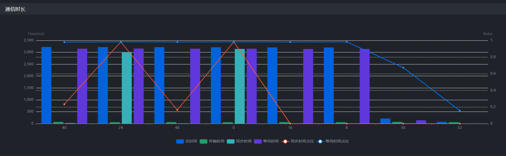
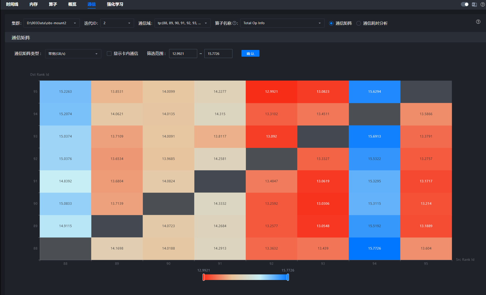
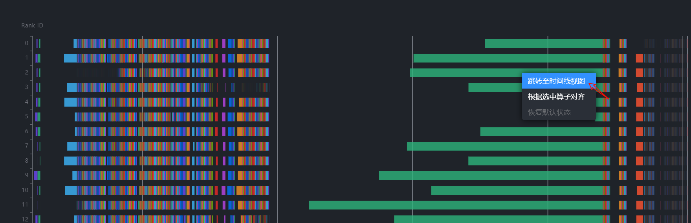
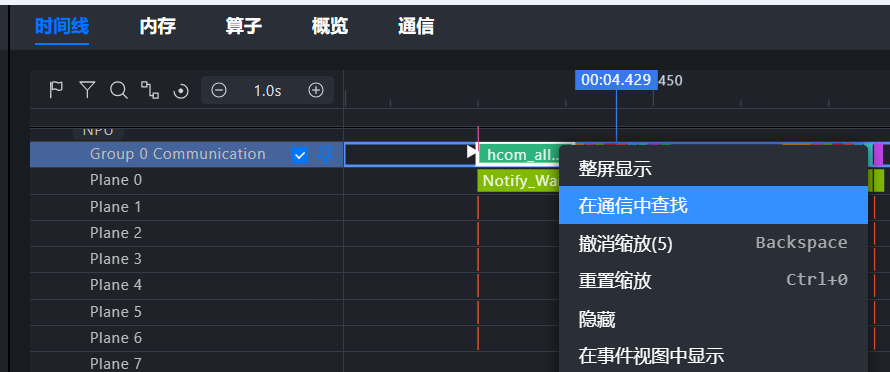

# 算子性能问题

> 来源: [https://www.hiascend.com/document/detail/zh/mindstudio/830/practicalcases/GeneralPerformanceIssue/toolsample6_020.html?framework=pytorch](https://www.hiascend.com/document/detail/zh/mindstudio/830/practicalcases/GeneralPerformanceIssue/toolsample6_020.html?framework=pytorch)

# 通信（Communication）

通信（Communication）页签将通信指标按通信域拆解。如果在概览（Summary）界面中显示通信时间过长，可在通信（Communication）界面进一步确认是否存在慢卡或慢链路问题。可在图1红框所示位置切换**通信矩阵** 视图或**通信耗时分析** 视图。

**图1** 切换通信矩阵或通信耗时分析视图  

#### 操作步骤

  1. 在通信（Communication）界面，选择“通信耗时分析”，查看“通信时长”图，确认传输时间在通信时间中的占比是否过高，如图2所示。

其中**传输时间过长为慢链路问题** ，**同步时间过长** 为**慢卡** 问题。

**图2** 通信时长  

  2. 如果传输时间占比过高，再选择“通信矩阵”，查看通信矩阵图，分析传输带宽是否远低于经验带宽，如图3所示。在传输数据量足够的前提下，如果带宽明显低于预期带宽, 可以认为存在优化空间。常见慢链路原因包括通信重传、通信小包、数据包字节未对齐等，具体可参考[通信问题优化方案](https://www.hiascend.com/document/detail/zh/mindstudio/830/practicalcases/GeneralPerformanceIssue/toolsample6_028.html?framework=pytorch)中相关案例。

**图3** 通信矩阵  

  3. 如果传输时间占比低，等待或同步时间占比高，则为“快慢卡问题”，需选择“通信耗时分析”。通过通信算子横向平铺，查看“通信算子缩略图”锁定慢卡，如图4所示。针对绿色的hcom allGather集合通信算子，时长较短的4卡、5卡、13卡为慢卡，而时长较长的卡（例如11卡、14卡等）为相对的快卡。接下来需要分析慢卡在空白时间做什么？需前往时间线（Timeline）界面，查看具体差异点，详细可参考[快慢卡定位Timeline操作案例](https://www.hiascend.com/document/detail/zh/mindstudio/830/practicalcases/GeneralPerformanceIssue/toolsample6_034.html?framework=pytorch)。

**图4** 锁定慢卡  

#### 通信与时间线相互跳转

  * 支持通信（Communication）界面与时间线（Timeline）界面，根据通信算子互相跳转，如图5和图6所示。

若在通信界面定位到异常卡与异常通信算子，可跳转至时间线视图，进一步确认问题根因；若在时间线界面观察到耗时异常长的通信算子，也可跳转至通信界面，寻找是否有同一通信域内的慢卡拖累了此卡，导致长时间的等待耗时。

**图5** 通信界面算子跳转至时间线界面  

**图6** 时间线界面通信算子跳转至通信界面  

**父主题：** [集群性能分析](https://www.hiascend.com/document/detail/zh/mindstudio/830/practicalcases/GeneralPerformanceIssue/toolsample6_018.html?framework=pytorch)
