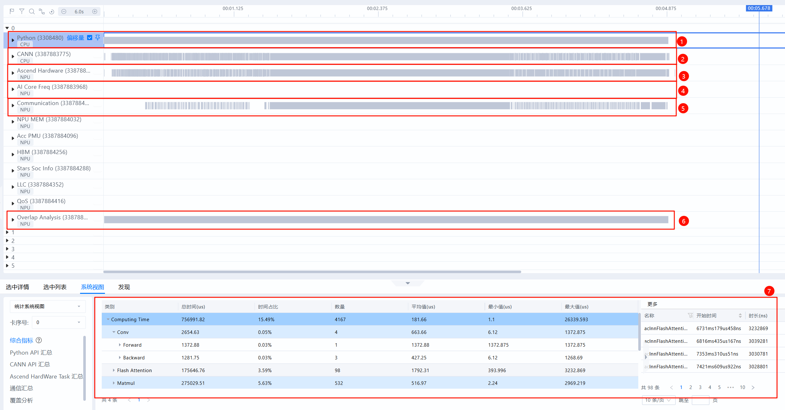
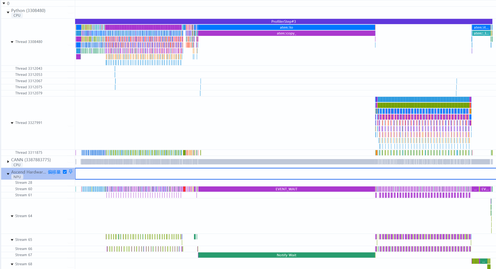
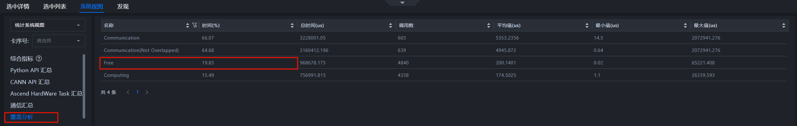
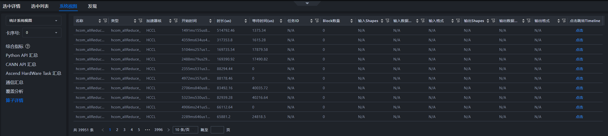

# 算子性能问题案例

> 来源: [https://www.hiascend.com/document/detail/zh/mindstudio/830/practicalcases/GeneralPerformanceIssue/toolsample6_021.html?framework=pytorch](https://www.hiascend.com/document/detail/zh/mindstudio/830/practicalcases/GeneralPerformanceIssue/toolsample6_021.html?framework=pytorch)

# 时间线（Timeline）

时间线（Timeline）是将训练或推理过程中的Host、Device上的运行详细情况平铺在时间轴上，直观呈现Host侧的API耗时以及Device侧的Task耗时。常用泳道与界面如图1所示，界面信息说明如表1所示。

**图1** 时间线常用泳道与界面  

**表1** 时间线常用泳道与界面信息说明序号 | 名称 | 说明  
---|---|---  
1 | Python泳道（一级流水） | 查看Python层代码，采集时开启with stack开关可查看代码调用栈。  
2 | CANN泳道（二级流水） | 收集ACL接口执行、GE融合、Runtime等数据。Python侧算子从一级流水下发至此二级流水，任务从二级流水出队后被下发至NPU层。  
3 | Ascend Hardware（NPU层） | 也称Device侧，记录发生在NPU上计算、通信等任务的执行时序。  
4 | AI Core Freq（AI Core频率） | AI Core频率，可用于观察降频问题。  
5 | Communication（通信） | 旧称HCCL泳道。记录NPU层通信事件，与Ascend Hardware的通信子泳道一一对应，此处由HCCL等组件上报。定位通信细节时可查看此泳道。  
6 | Overlap Analysis（覆盖分析） | 将Ascend Hardware（NPU层）的计算、通信任务垂直投影至此，得到计算、通信、空闲时间的拆分。常用于快速比对不同卡间计算、通信、空闲差异来源。  
7 | Stats System View（统计视图） | 单卡维度统计汇总信息，可通过左侧“卡序号”下拉框切换不同卡。  
  
此处列举了定位过程中Timeline最常用的泳道与界面，每条泳道可展开查看具体细节，如图2所示。完整界面介绍请参见《[MindStudio Insight工具用户指南](https://www.hiascend.com/document/detail/zh/mindstudio/830/GUI_baseddevelopmenttool/msascendinsightug/Insight_userguide_0002.html)》的“系统调优 > [时间线（Timeline）](https://www.hiascend.com/document/detail/zh/mindstudio/830/GUI_baseddevelopmenttool/msascendinsightug/Insight_userguide_0034.html)”章节。

**图2** 泳道展开查看具体细节  

#### 常用操作

想要快速查看或了解当前所有快捷键操作，可单击界面右上角的问号按钮，在下拉菜单中选择“键盘快捷键”，即可打开快捷键说明的弹窗。

Timeline常用操作包括**通信与时间线相互跳转、置顶比对、覆盖分析、旗帜标记重点区域、框选统计、下发连线关系查看** 等功能。详情请参见《[MindStudio Insight工具用户指南](https://www.hiascend.com/document/detail/zh/mindstudio/830/GUI_baseddevelopmenttool/msascendinsightug/Insight_userguide_0002.html)》的“系统调优 > [时间线（Timeline）](https://www.hiascend.com/document/detail/zh/mindstudio/830/GUI_baseddevelopmenttool/msascendinsightug/Insight_userguide_0034.html)”章节。

#### 定位快慢卡具体差异来源

时间线（Timeline）常用于进一步定位快慢卡具体的差异来源。理想情况下，每张卡的计算用时相对接近，不应存在某张卡提前完成计算，长时间等待另一张卡的情况。当出现某些卡存在时长较长的通信算子，且通信算子主要时长来源于等待（例如Notify Wait事件）时，优先考虑是否出现了快慢卡问题。

快慢卡是一个现象，背后原因多种多样，需要通过比对快慢卡在时间线上的差异，确认具体原因。慢卡常见原因包括负载不均衡、计算慢、下发慢、数据加载慢（存储问题）。具体定位过程如下：

  1. 在通信（Communication）界面的通信算子缩略图中，查看差异较大的通信算子，并跳转至时间线界面。
  2. 通过覆盖分析、置顶比对，确认Ascend Hardware层（NPU层）差异来源。
  3. 在时间线（Timeline）界面选择async_npu下发连线，通过连线关系，由NPU层向上寻找，确认Python层差异来源。确认差异来源于某处Python层代码后，可凭借此信息，与模型开发或运维人员进一步确认问题根因。

时间线（Timeline）界面功能比较多，可以通过一个实际案例来具体感受下各种功能的作用，详细案例请参见[快慢卡定位Timeline操作案例](https://www.hiascend.com/document/detail/zh/mindstudio/830/practicalcases/GeneralPerformanceIssue/toolsample6_034.html?framework=pytorch)。

#### 观察下发瓶颈

时间线（Timeline）是观察下发问题的有力工具，理想情况下NPU侧的计算流水线能不停运转，不会出现NPU等CPU的场景。一旦下发慢，将导致流水线无法运转，AI Core算力利用率降低。

理想Free Time占比约为10%以内。

下发瓶颈在时间线（Timeline）典型表现分别如下所示。具体定位方法论与优化思路请参考[下发异常分析](https://www.hiascend.com/document/detail/zh/mindstudio/830/practicalcases/GeneralPerformanceIssue/toolsample6_075.html?framework=pytorch)。

  * 覆盖分析Free Time占比远超Computing和Communication，如图3和图4所示。

**图3** 下发瓶颈典型表现1  

**图4** 下发瓶颈典型表现2  

  * HostToDevice连线接近垂直，如图5所示。

**图5** 下发瓶颈典型表现3  

  * 频繁HostToDevice拷贝打断异步流水，造成下发瓶颈，如图6所示。

**图6** 下发瓶颈典型表现4  

#### 单卡维度统计与搜索算子

如果想在时间线（Timeline）中查看算子具体位置，可在底部数据窗格中选择“系统视图”，选择“统计系统视图”和相应“卡序号”，单击“算子详情”，可查看所有算子，并可按照名称、类型、加速器核、输入/输出Shapes过滤，按耗时排序，选择相应算子，单击“点击跳转Timeline”列的“点击”，可跳转至时间线的具体位置，如图7所示。此操作比全局搜索定位更快。

**图7** 算子详情  

**父主题：** [单卡性能分析](https://www.hiascend.com/document/detail/zh/mindstudio/830/practicalcases/GeneralPerformanceIssue/toolsample6_021.html?framework=pytorch)
