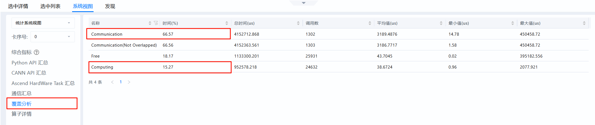
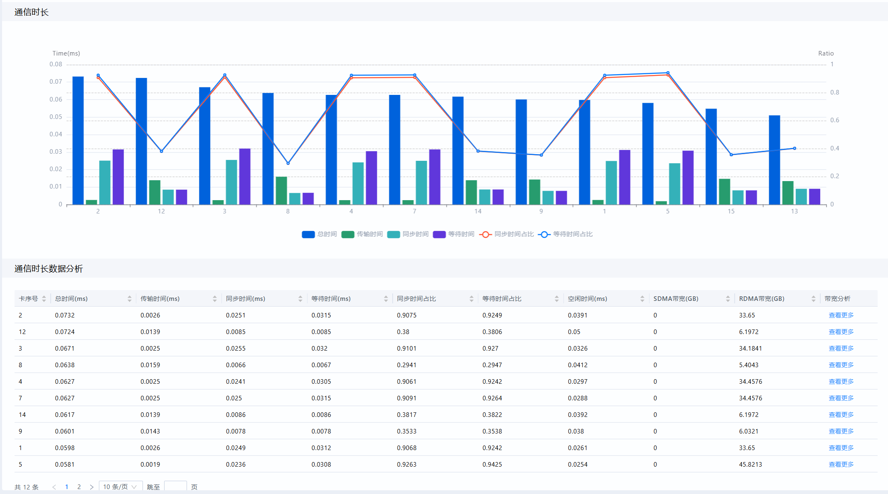
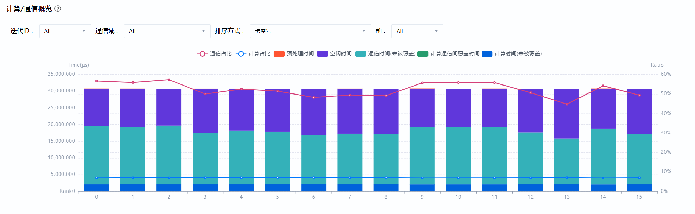

# MindIE推理场景

> 来源: [https://www.hiascend.com/document/detail/zh/mindstudio/830/practicalcases/GeneralPerformanceIssue/toolsample6_028.html?framework=pytorch](https://www.hiascend.com/document/detail/zh/mindstudio/830/practicalcases/GeneralPerformanceIssue/toolsample6_028.html?framework=pytorch)

# 总体介绍

通信问题最直观的表现是，集群通信时间较长，通信时长占比远远大于计算，如图1所示；或者存在明显超长时间的通信算子，如图2所示，可以看到图中标注①与标注②是两个时间远大于计算流的reduceScatter算子。

**图1** 通信问题表现1：通信时长远大于计算时长  

**图2** 通信问题典型表现2：存在明显超长时间的通信算子  

这里需要注意的是，某张卡的通信问题不一定是通信传输本身造成的，也可能是由于等待其它慢卡造成的，即快慢卡问题。

要排查某张卡的通信时长过长是通信传输本身的问题还是快慢卡问题，可通过如下方式：

  * 按照[通信（Communication）](https://www.hiascend.com/document/detail/zh/mindstudio/830/practicalcases/GeneralPerformanceIssue/toolsample6_020.html?framework=pytorch)介绍，进入MindStudio Insight的通信耗时分析页签，若该卡的**传输时间** 占比较高，则可认为是通信传输本身存在问题；**同步时间** 占比较高，则可认为是快慢卡问题。

**图3** 通信时长分析  

  * 可通过[概览（Summary）](https://www.hiascend.com/document/detail/zh/mindstudio/830/practicalcases/GeneralPerformanceIssue/toolsample6_019.html?framework=pytorch)页签对比多卡计算、通信、空闲时间，观察是否是快慢卡问题。以图4为例，若观察到各卡的空闲时间和通信时间呈负相关（即空闲时间长的，通信时间短；空闲时间短的，通信时间长），则有较大概率可以判断，该集群存在下发性能波动导致的快慢卡问题。同理，也存在计算时间和通信时间呈负相关的计算快慢卡问题。

**图4** 下发快慢卡问题  

若确认为快慢卡问题，可参考[快慢卡问题定位方法](https://www.hiascend.com/document/detail/zh/mindstudio/830/practicalcases/GeneralPerformanceIssue/toolsample6_030.html?framework=pytorch)进一步定位造成快慢卡差异的原因。

若确认不是快慢卡问题，则关注通信本身，可能原因包括[通信小包](https://www.hiascend.com/document/detail/zh/mindstudio/830/practicalcases/GeneralPerformanceIssue/toolsample6_042.html?framework=pytorch)、[通信重传](https://www.hiascend.com/document/detail/zh/mindstudio/830/practicalcases/GeneralPerformanceIssue/toolsample6_039.html?framework=pytorch)、[源地址与目标地址不对齐](https://www.hiascend.com/document/detail/zh/mindstudio/830/practicalcases/GeneralPerformanceIssue/toolsample6_044.html?framework=pytorch)、[Profiling性能膨胀](https://www.hiascend.com/document/detail/zh/mindstudio/830/practicalcases/GeneralPerformanceIssue/toolsample6_046.html?framework=pytorch)、[计算通信带宽抢占](https://www.hiascend.com/document/detail/zh/mindstudio/830/practicalcases/GeneralPerformanceIssue/toolsample6_047.html?framework=pytorch)等原因。

**父主题：** [通信问题优化方案](https://www.hiascend.com/document/detail/zh/mindstudio/830/practicalcases/GeneralPerformanceIssue/toolsample6_028.html?framework=pytorch)
