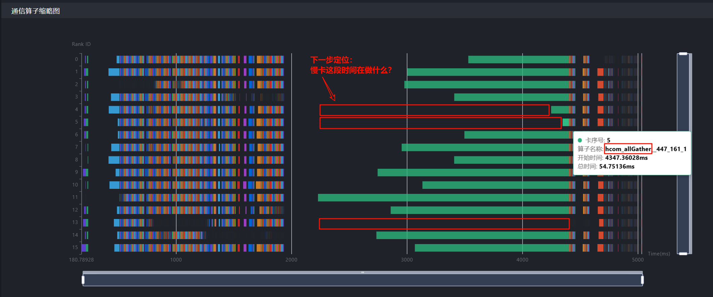
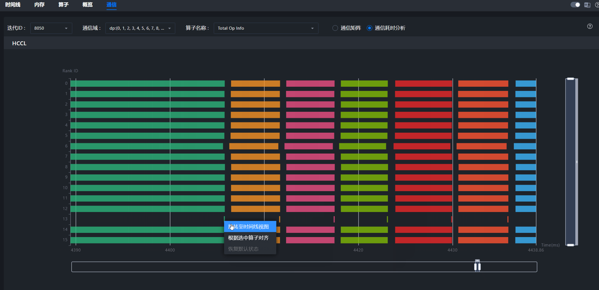
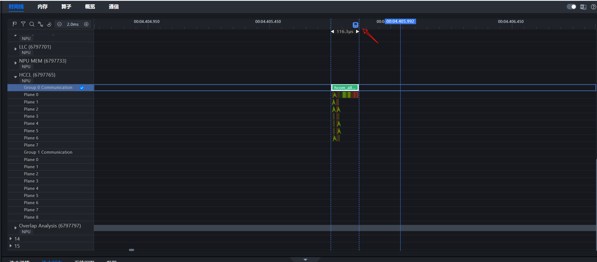
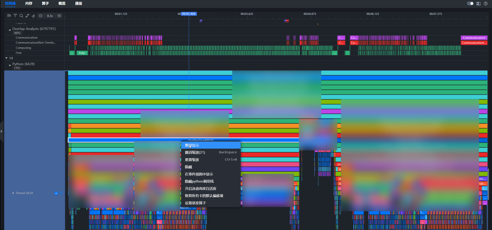
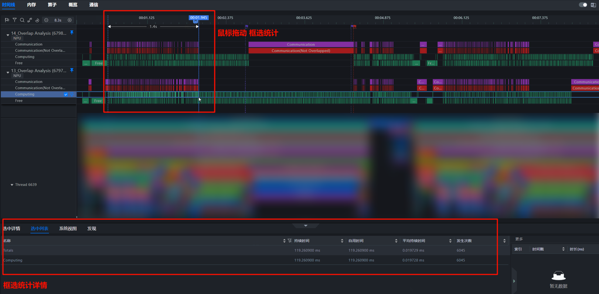
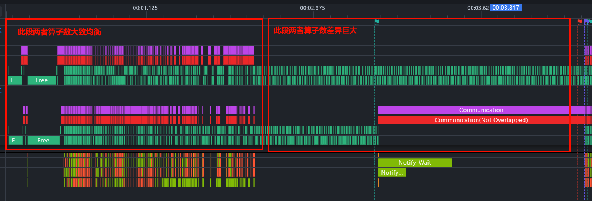
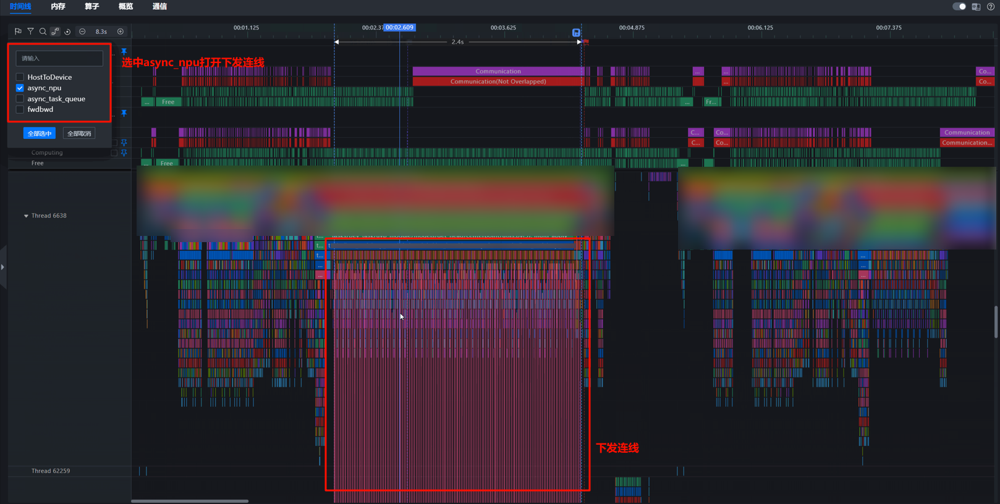

# 版本升级

> 来源: [https://www.hiascend.com/document/detail/zh/mindstudio/830/practicalcases/GeneralPerformanceIssue/toolsample6_034.html?framework=pytorch](https://www.hiascend.com/document/detail/zh/mindstudio/830/practicalcases/GeneralPerformanceIssue/toolsample6_034.html?framework=pytorch)

# 快慢卡定位Timeline操作案例

本节介绍利用MindStudio Insight进一步定位快慢卡问题的具体操作案例。

若我们通过[概览（Summary）](https://www.hiascend.com/document/detail/zh/mindstudio/830/practicalcases/GeneralPerformanceIssue/toolsample6_019.html?framework=pytorch)已经初步锁定了集群中存在快慢卡不同步问题，并且通过[通信（Communication）](https://www.hiascend.com/document/detail/zh/mindstudio/830/practicalcases/GeneralPerformanceIssue/toolsample6_020.html?framework=pytorch)确认，集群通信时间里，传输时间占比低，等待或同步时间占比高，则确认当前集群存在“快慢卡问题”，需查看“通信耗时分析”。通过通信算子横向平铺，确认慢卡具体慢在哪里。

如图1所示，其中针对绿色的hcom allGather集合通信算子，时长较短的4卡、5卡、13卡为慢卡，而时长较长的卡（例如11卡、14卡等）为相对的快卡。

下一步定位目标为：分析慢卡在空白时间做什么？需前往时间线（Timeline）模块，查看具体差异点。

**图1** 通信算子平铺图  

  1. 选择通信算子，单击鼠标右键，选择“跳转至时间线视图”，由通信算子跳转至时间线视图，用旗帜标记大致范围，方便后续定位。

**图2** 由通信算子跳转至时间线视图  

**图3** 用旗帜标记大致范围  

  2. 选择一个Step（按Step整屏显示），置顶对比慢卡（13卡）与快卡（14卡）的Overlap Analysis泳道，确认差异来源（Overlap Analysis泳道将Ascend Hardware层计算、通信任务统一投影，比对更清晰）。

**图4** 将研究区域限定在一个Step内（按Step整屏显示）  

**图5** 置顶对比慢卡（13卡）与快卡（14卡）的覆盖分析泳道，确认差异来源  

  3. 框选统计可以看到，慢卡泳道计算任务次数明显多于快卡。

**图6** 框选统计  

差异主要来源于后半段，说明是负载不均导致了快慢卡问题。

**图7** 算子数差异对比  

  4. 根据async_npu下发连线，确认多出的算子由哪个Python API下发（锁定框选区域，可按照锁定区域展示连线，而不展示全量连线）。

**图8** async_npu下发连线  

对Ascend Hardware层框选统计得出，同样的Python侧某API，快卡下发1218个计算算子，慢卡下发3303个计算算子，所以是由于该Python侧某API负载不均导致快慢卡。

  5. 和模型开发人员确认，该负载不均能否规避。

**父主题：** [快慢卡问题定位方法](https://www.hiascend.com/document/detail/zh/mindstudio/830/practicalcases/GeneralPerformanceIssue/toolsample6_030.html?framework=pytorch)
