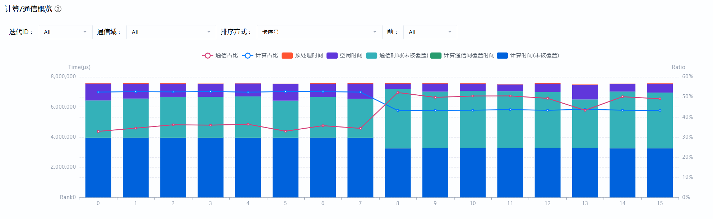
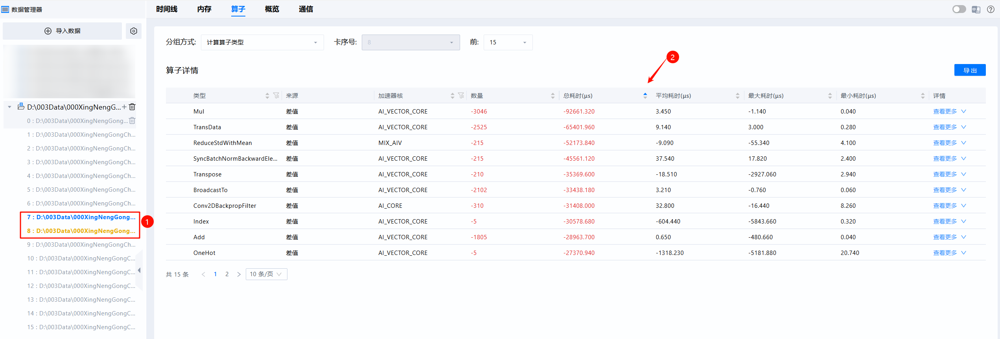
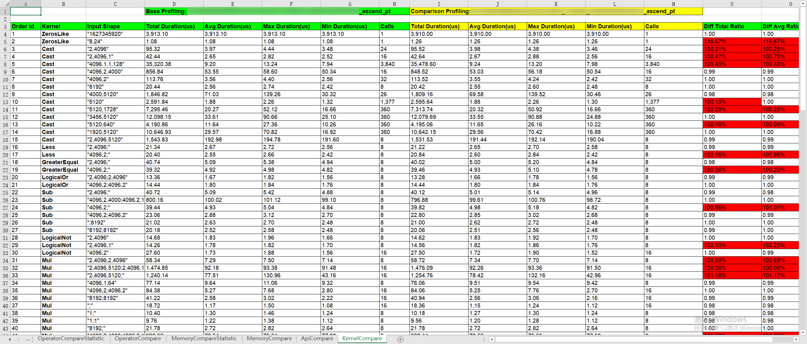

# 版本升级案例

> 来源: [https://www.hiascend.com/document/detail/zh/mindstudio/830/practicalcases/GeneralPerformanceIssue/toolsample6_035.html?framework=pytorch](https://www.hiascend.com/document/detail/zh/mindstudio/830/practicalcases/GeneralPerformanceIssue/toolsample6_035.html?framework=pytorch)

# 快慢卡定位算子比对操作案例

若在MindStudio Insight的概览界面发现集群的快慢卡是计算时间波动导致的，除了使用[快慢卡定点精确分析法](https://www.hiascend.com/document/detail/zh/mindstudio/830/practicalcases/GeneralPerformanceIssue/toolsample6_032.html?framework=pytorch)中提到的定点精确分析法以外，还可以尝试比对快慢卡算子耗时，快速锁定差异来源。

#### 从概览页确定快慢卡

在MindStudio Insight的概览界面查看计算/通信概览区域，可以看到，0-7卡为计算慢卡（计算时间长，通信时间短），8-15卡为计算快卡（计算时间短，通信时间长）后者通信时间长是等待前者所导致的。

**图1** 计算快慢卡概览页  

#### 对比算子差异

按照[算子（Operator）](https://www.hiascend.com/document/detail/zh/mindstudio/830/practicalcases/GeneralPerformanceIssue/toolsample6_024.html?framework=pytorch)中描述，可以快速锁定造成耗时差异的算子，如图2所示，首先设置7、8两卡进入卡间比对模式，随后按总耗时升序排列。若快慢卡存在较大算子数量差异，说明存在计算负载任务不均衡的问题，可与模型开发人员确认，该负载不均能否规避；若某类算子数量一致，但平均耗时存在差异，可求助相关算子开发负责人，或者结合[快慢卡定点精确分析法](https://www.hiascend.com/document/detail/zh/mindstudio/830/practicalcases/GeneralPerformanceIssue/toolsample6_032.html?framework=pytorch)中方法，通过时间线（Timeline）进一步确认问题根因。

**图2** 算子卡间比对  

同理，也可使用[模型调优快速分析（msprof-analyze命令行工具）](https://www.hiascend.com/document/detail/zh/mindstudio/830/practicalcases/GeneralPerformanceIssue/toolsample6_014.html?framework=pytorch)工具中的compare工具，进入KernelCompare比对页，分析算子差异。

**图3** compare性能拆解比对工具KernelCompare比对页  

**父主题：** [快慢卡问题定位方法](https://www.hiascend.com/document/detail/zh/mindstudio/830/practicalcases/GeneralPerformanceIssue/toolsample6_030.html?framework=pytorch)
