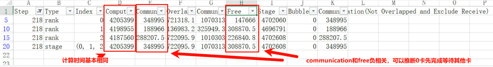

# 版本升级实践

> 来源: [https://www.hiascend.com/document/detail/zh/mindstudio/830/practicalcases/GeneralPerformanceIssue/toolsample6_036.html?framework=pytorch](https://www.hiascend.com/document/detail/zh/mindstudio/830/practicalcases/GeneralPerformanceIssue/toolsample6_036.html?framework=pytorch)

# 案例一：集群保存checkpoint后性能持续劣化

#### 问题描述

4机64卡，保存checkpoint后性能持续劣化。

#### 问题分析

首先，如图1所示，利用[模型调优快速分析（msprof-analyze命令行工具）](https://www.hiascend.com/document/detail/zh/mindstudio/830/practicalcases/GeneralPerformanceIssue/toolsample6_014.html?framework=pytorch)中的msprof-analyze工具进行集群分析后，发现communication time和free time卡间波动趋势呈负相关（即同一张Rank中，communication耗时长的Free耗时短，communication耗时短的Free耗时长），推测出Free Time时间最短的0卡最先结束，等待其他卡，为快卡；Free Time时间最长的1卡最后结束，为慢卡。即此案例为Host侧下发性能波动导致的快慢卡问题。

**图1** cluster_step_trace_time.csv交付件  

进入时间线（Timeline）视图，如图2与图3所示，发现0卡通信等待发生在反向传播后的梯度汇总阶段。对比快慢卡时间线（Timeline）的相近位置，发现慢卡Rank1的Step末尾存在异常空洞，在此阶段卡顿，导致了快卡Rank0的等待。

**图2** Timeline视图（Rank0）  

**图3** Timeline视图（Rank1）  

#### 定位完成

该问题最终定位原因是代码在慢卡Step末尾存在未释放内存，手动清空后问题消失。

**父主题：** [快慢卡案例补充](https://www.hiascend.com/document/detail/zh/mindstudio/830/practicalcases/GeneralPerformanceIssue/toolsample6_036.html?framework=pytorch)
