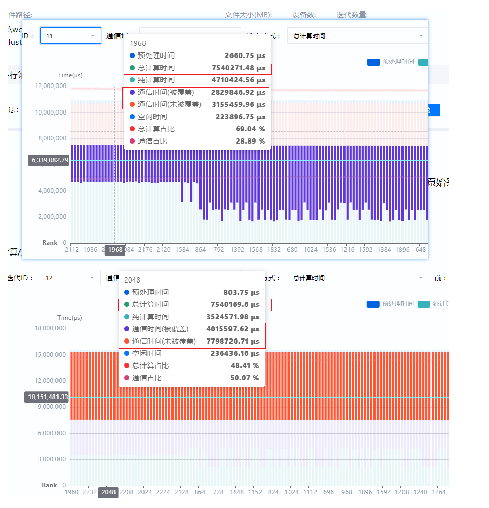
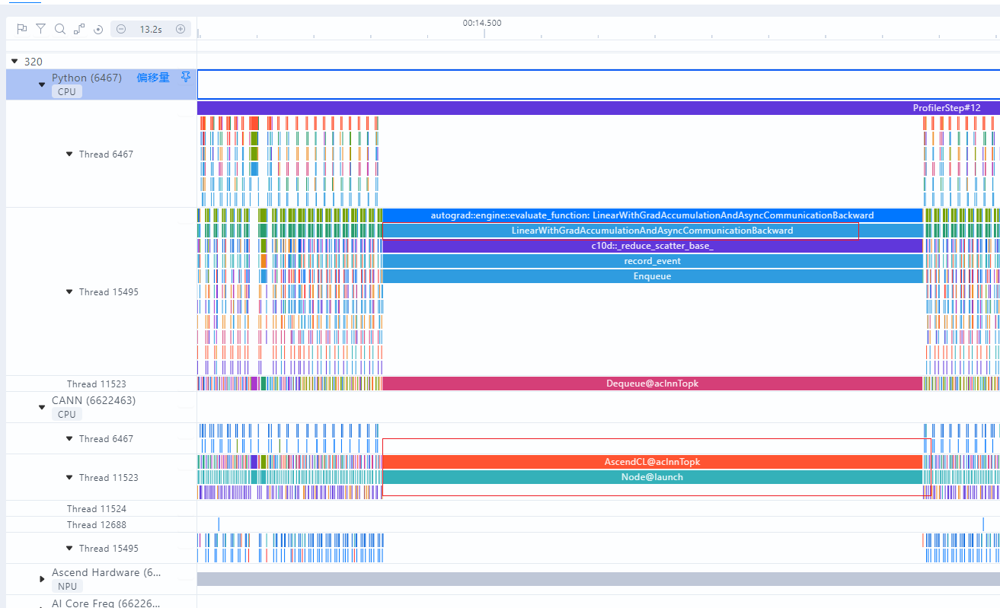

# 通信优化案例

> 来源: [https://www.hiascend.com/document/detail/zh/mindstudio/830/practicalcases/GeneralPerformanceIssue/toolsample6_039.html?framework=pytorch](https://www.hiascend.com/document/detail/zh/mindstudio/830/practicalcases/GeneralPerformanceIssue/toolsample6_039.html?framework=pytorch)

# 基于集群数据分析是否出现通信重传

在分布式训练中，如果发现某个通信算子耗时超过4秒（通信重传的典型阈值），在排除快慢卡问题的可能性后，可以怀疑是发生了数据包重传。仅凭单张卡的性能数据，很难直接区分这两种情况，可通过MindStudio Insight进一步排查。

通常通信重传多出现在集群间的性能抖动问题中，可以通过MindStudio Insight对比正常和异常Step的Profiling数据确认。

  1. 在MindStudio Insight集群结果概览页，可以看到不同Step的耗时分布，如图1所示。

**图1** MindStudio Insight集群概览页  

  2. 对比两个Step的概览结果，可以发现各卡间的计算时间和空闲时间比较接近，说明没有明显的快慢卡问题，差异点主要体现在通信耗时（通信时间（被覆盖）+ 通信时间（未被覆盖））上。
  3. 同时同步对比所有卡，发现Step11和Step12每一张卡的通信耗时差距都在4.7s左右。
  4. 如图2所示，观察320卡的时间线（Timeline）结果，算子为LinearWithGradAccumulationAndAsyncCommunication，该算子为用于同步的通信算子，后续任务下发时（AscendCL@aclnnTopK）被阻塞。

**图2** Rank320的Timeline  

结合各项数据分析，NPU（计算）和CPU（调度）均正常，各卡间通信时间的差异来源于点对点通信异常超时，大概率为网络异常导致的通信重传。

  5. 发现通信重传问题后，建议排查交换机网络是否正常配置，例如，是否未添加PFC控制机制，导致PFC拥塞，进而导致通信重传。

**父主题：** [通信重传](https://www.hiascend.com/document/detail/zh/mindstudio/830/practicalcases/GeneralPerformanceIssue/toolsample6_039.html?framework=pytorch)
