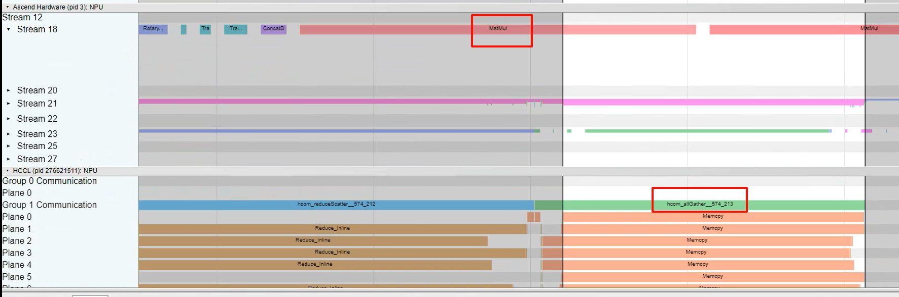

# 集群优化案例

> 来源: [https://www.hiascend.com/document/detail/zh/mindstudio/830/practicalcases/GeneralPerformanceIssue/toolsample6_047.html?framework=pytorch](https://www.hiascend.com/document/detail/zh/mindstudio/830/practicalcases/GeneralPerformanceIssue/toolsample6_047.html?framework=pytorch)

# 计算通信带宽抢占

MatMul、FA等算子属于访存密集型算子，容易发生mte bound。此类算子与通信算子并行时，如图1所示，会发生计算通信对于内存带宽的抢占，导致通信传输带宽低于经验值（可能会下降1~2倍左右，但不会特别低），如图2所示。

**解决方法** ：若计算通信并行导致的带宽抢占现象较为严重，可以比较通算并行与未并行的性能数据，评估带宽抢占的影响是否超过了通算并行的收益，选择性能更优的方式。

**图1** Matmul算子与allGather通信算子并行  

**图2** allGather算子发生计算通信带宽抢占  

**父主题：** [通信问题优化方案](https://www.hiascend.com/document/detail/zh/mindstudio/830/practicalcases/GeneralPerformanceIssue/toolsample6_028.html?framework=pytorch)
