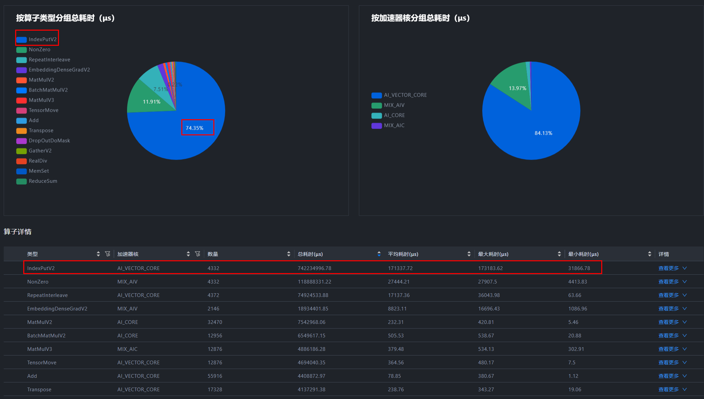

# 服务化优化案例

> 来源: [https://www.hiascend.com/document/detail/zh/mindstudio/830/practicalcases/GeneralPerformanceIssue/toolsample6_050.html?framework=pytorch](https://www.hiascend.com/document/detail/zh/mindstudio/830/practicalcases/GeneralPerformanceIssue/toolsample6_050.html?framework=pytorch)

# 亲和算子优化策略

#### 问题描述

在B4训练BERT模型的时候发现和A100性能差距非常明显。训练相同的step，A100耗时45s，B4耗时1000s，NPU性能约为0.045GPU。

#### 案例分析

  1. 查看覆盖分析表，发现整个step基本都在计算，Free占比非常低，因此首先从计算入手优化。

**图1** 覆盖分析表  

**图2** 查看计算算子  

  2. 查看算子耗时，发现IndexPutV2算子计算占了总耗时的75%，因此需要对该算子优化，具体优化方法请参考表2。

本示例以IndexPutV2算子为例，其他算子情况类似，具体请参见表1和表2。

**表1** Linear、Reduce_Sum、BatchMatMulV2、RepeatInterleave及Gatherelement算子代码优化算子名称 | 代码优化前 | 代码优化后 | 说明  
---|---|---|---  
Linear | 
         
         # # # #  修改前 # # #   
         model=nn.Linear(K,N)
         input=torch.randn(M,K)
         res=model(input)

| 
         
         ###修改后###
         res=torch.addmm(bias,input,weight.t())#此处的input为(M,K),weight为(N,K)---weight.t()为(K,N)

| 不区分场景，仅提供一种优化方案。  
Reduce_Sum | 
         
         mask = torch.nn.functional.one_hot(indices, num_classes=self.num_experts).sum(dim=1)

| 
         
         temp_mask = torch.zeros(indices.shape[0], self.num_experts, device="npu", dtype=torch.bfloat16)
         mask=temp_mask.scatter_(-1,indices,1.0)

| mask创建方式从onehot+reducesum变成了zeros+scatter，局部计算时间从2.2ms优化到0.08ms，总时间优化306ms。  
BatchMatMulV2 | 
         
         output = tf.matmul(a, b, transpose_a=True) #  a: [bs, n, 1], b: [n, 1]

| 
         
         a_ = tf.transpose(a, perm=[0, 2, 1])
         a_=tf.reshape(a_,[-1,a_.shape[2]])
         output=tf.matmul(a_,b,transpose_a=True)#a_:[bs,n],b:[n,1]

| 该算子在输入shape:[b, n, 1]与[n, 1]输出shape:[b, 1, 1]时性能会劣化，当bmm算子输出shape存在[1, 1]的情况时需要规避，将b与1进行合轴，tf.matmul在两个相乘矩阵为两维自动执行MatMul算子，当输入shape有[b, 1, 1]时，反向传播也会执行该算子，可替换为点乘。  
RepeatInterleave | 
         
         valid_lens = torch.repeat_interleave(valid_lens, shape[1])

| 
         
         valid_lens = valid_lens.unsqueeze(-1).expand(-1, shape[1]).reshape(-1)

| 使用改变shape从而切换高性能分支的方法优化该算子。 在输入第二个维度时，不直接传入shape[1]，而是将shape[1]替换为长度2048的1维tensor，形式为torch.tensor([shape[1],shape[1],shape[1],...,shape[1]])。  
Gatherelement | 
         
         pt = logit.gather(1.target).view(-1) + eps
         logpt=torch.log(pt)
         alpha=self.alpha.to(logpt.device)
         alpha_class=alpha.gather(0,target.view(-1))

| 
         
         pt = logit[torch.arange(logit.size(0)), target.squeeze(1)] + eps
         logpt=torch.log(pt)
         alpha=self.alpha.to(logpt.device)
         alpha_class=torch.index_select(alpha,0,target.view(-1))

| 当前NPU上调用Gatherelement算子会有性能劣化，使用torch.index_select函数替换torch.gather函数后，调用算子修改为GatherV2规避，修改时需要注意修改索引。  
  
**表2** 其他算子优化算子名称 | 官方链接  
---|---  
IndexPutV2 | <https://www.hiascend.com/document/detail/zh/Pytorch/60RC3/ptmoddevg/trainingmigrguide/performance_tuning_0033.html>  
MatMul/hcom_allReduce | <https://www.hiascend.com/document/detail/zh/Pytorch/60RC3/ptmoddevg/trainingmigrguide/performance_tuning_0026.html>  
Nonzero | <https://www.hiascend.com/document/detail/zh/Pytorch/60RC3/ptmoddevg/trainingmigrguide/performance_tuning_0034.html>  
where | <https://www.hiascend.com/document/detail/zh/Pytorch/60RC3/ptmoddevg/trainingmigrguide/performance_tuning_0035.html>  
RotaryMul & RotaryMulGrad（融合算子） | <https://www.hiascend.com/document/detail/zh/Pytorch/600/ptmoddevg/trainingmigrguide/performance_tuning_0023.html>  
RmsNorm & RmsNormGrad | <https://www.hiascend.com/document/detail/zh/Pytorch/600/ptmoddevg/trainingmigrguide/performance_tuning_0024.html>  
ScaledMaskedSoftmax & ScaledMaskedSoftmaxGrad | <https://www.hiascend.com/document/detail/zh/Pytorch/600/ptmoddevg/trainingmigrguide/performance_tuning_0025.html>  
MatmulAllReduce | <https://www.hiascend.com/document/detail/zh/Pytorch/600/ptmoddevg/trainingmigrguide/performance_tuning_0026.html>  
FlashAttentionScore | <https://www.hiascend.com/document/detail/zh/Pytorch/600/ptmoddevg/trainingmigrguide/performance_tuning_0027.html>  
SwiGlu | <https://www.hiascend.com/document/detail/zh/Pytorch/600/ptmoddevg/trainingmigrguide/performance_tuning_0100.html>  
融合优化器 | <https://www.hiascend.com/document/detail/zh/Pytorch/600/ptmoddevg/trainingmigrguide/performance_tuning_0028.html>  
融合算子替换官方文档 | <https://www.hiascend.com/document/detail/zh/Pytorch/60RC3/ptmoddevg/trainingmigrguide/performance_tuning_0023.html>  
亲和算子替换官方文档 | <https://www.hiascend.com/document/detail/zh/Pytorch/60RC3/ptmoddevg/trainingmigrguide/performance_tuning_0033.html>  
亲和API替换官方文档 | <https://www.hiascend.com/document/detail/zh/Pytorch/60RC3/ptmoddevg/trainingmigrguide/performance_tuning_0036.html>  
  

**父主题：** [算子性能问题优化方案](https://www.hiascend.com/document/detail/zh/mindstudio/830/practicalcases/GeneralPerformanceIssue/toolsample6_048.html?framework=pytorch)
