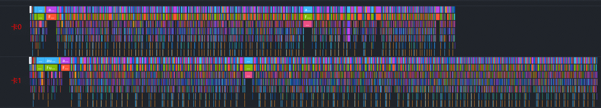

# 高级调优案例

> 来源: [https://www.hiascend.com/document/detail/zh/mindstudio/830/practicalcases/GeneralPerformanceIssue/toolsample6_075.html?framework=pytorch](https://www.hiascend.com/document/detail/zh/mindstudio/830/practicalcases/GeneralPerformanceIssue/toolsample6_075.html?framework=pytorch)

# 问题背景

当前，下发异常是导致快慢卡问题的常见原因之一，典型表现如下。

  * 单张计算卡的特定算子执行耗时显著增加，从下图可以发现Dequeue@aclnnLogicalNot耗时明显长于左右部分的耗时（可通过MindStudio Insight的[时间线（Timeline）](https://www.hiascend.com/document/detail/zh/mindstudio/830/practicalcases/GeneralPerformanceIssue/toolsample6_022.html?framework=pytorch)观测）。

**图1** 单函数耗时异常增加  

  * 整体下发耗时延长，如图2所示，执行相同数量的算子，对比发现卡1的下发耗时明显更长。

**图2** 算子下发普遍变慢  

此类问题通常因场景复杂而定位困难，可归类为下发异常问题。

**父主题：** [下发异常分析](https://www.hiascend.com/document/detail/zh/mindstudio/830/practicalcases/GeneralPerformanceIssue/toolsample6_075.html?framework=pytorch)
