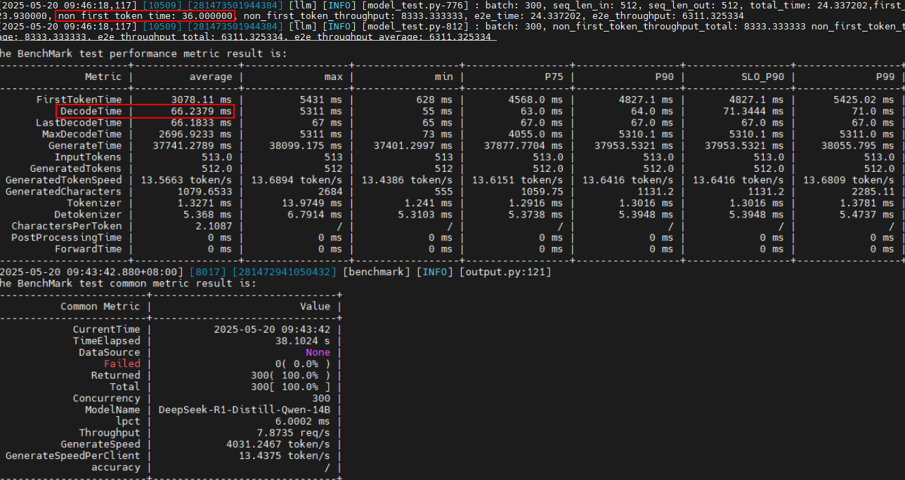
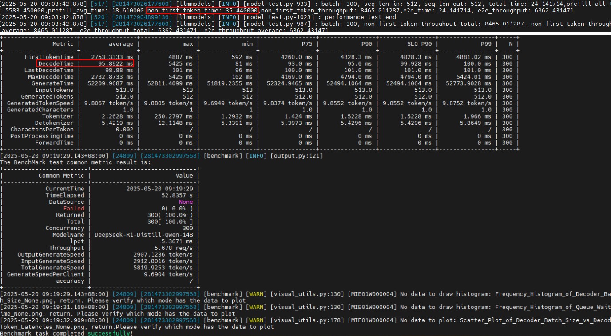

# 性能优化案例

> 来源: [https://www.hiascend.com/document/detail/zh/mindstudio/830/practicalcases/GeneralPerformanceIssue/toolsample6_111.html?framework=pytorch](https://www.hiascend.com/document/detail/zh/mindstudio/830/practicalcases/GeneralPerformanceIssue/toolsample6_111.html?framework=pytorch)

# 框架调度耗时导致性能劣化

#### 问题现象

同一个环境，其他配置都一样，MindIE 2.0.RC1相比MindIE 2.0.T3的服务化性能劣化了很多，需确认是否为版本问题。

如图1所示，上半部分截图为纯模型测试结果，300并发下纯模型Decode阶段平均时延为36ms，请查看图中红框标注的“non_first_token_time”；下半部分为服务化测试结果，300并发下Decode阶段平均时延约为66ms，请查看图中红框标注的“DecodeTime”。

**图1** MindIE 2.0.T3性能测试结果  

如图2所示，上半部分截图为纯模型测试结果，300并发下纯模型Decode阶段平均时延为35.44ms，请查看图中红框标注的“non_first_token_time”，与2.0.T3性能非常接近；下半部分为服务化测试结果，300并发下Decode阶段平均时延约为95ms，请查看图中红框标注的“DecodeTime”，较2.0.T3版本性能劣化50%。

**图2** MindIE 2.0.RC1性能测试结果  

#### 解决方案

  1. 使用预检工具dump对比一下配置，如图3所示，其中“ms_performance_prechecker_dump_20250520_152124.json”为MindIE 2.0.T3版本环境的落盘文件，“ms_performance_prechecker_dump_20250520_152138.json”为MindIE 2.0.RC1版本环境的落盘文件，除日志设置等不影响性能的环境变量外，没有看到明显的配置差异。

**图3** 对比配置  

  2. 采集MindIE 2.0.RC1的服务化性能数据进行对比，发现MindIE 2.0.RC1的Decode阶段forward之间的间隙过大，说明CPU侧的前后处理耗时长，如图4所示。

**图4** 查看forward  

  3. 开启异步调度，缩短forward间隙后，MindIE 2.0.RC1版本E2E输出吞吐2900->4500，较T3提升500token/s。异步调度的开启方式请参见《MindIE LLM开发指南》的异步调度章节。

**图5** 开启异步调度  

**父主题：** [服务化性能调优定位案例](https://www.hiascend.com/document/detail/zh/mindstudio/830/practicalcases/GeneralPerformanceIssue/toolsample6_111.html?framework=pytorch)
